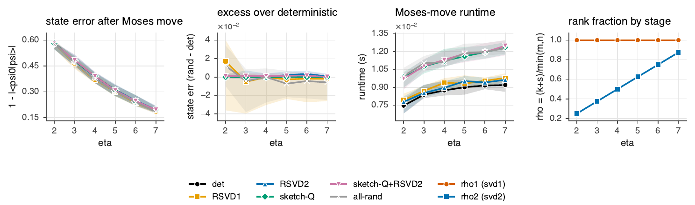
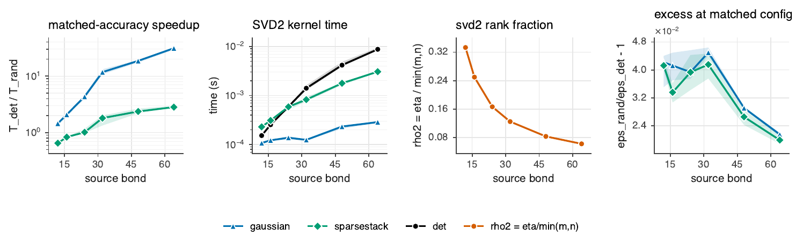

# Real Moses Move — randomized SVD: accuracy and speed

This note explains the `real_moses_move` results: **E1** (per-stage accuracy ablation)
and **exp02** (matched-accuracy *time-to-accuracy*). It defines every term — the methods
(`det`, `gaussian`, `sparsestack`, `sketch-Q`), the rank fraction $\rho$, the matched-accuracy
speedup — and states the math behind each. Figures live in
[`figures/real_moses_move/`](figures/real_moses_move/).

---

## 1. What the Moses move computes (the kernels we randomize)

An **isoTNS** represents a 2D state as a PEPS with an *orthogonality hypersurface*: tensors
on one side are isometries. The **Moses move** shifts that surface by one column — it
re-canonicalizes the PEPS. Operationally it sweeps a column, and at each site performs a
**local isometric tensor-ring split** built from **two truncated SVDs** plus an optional
**disentangler**. These local SVDs are the kernels we replace with randomized ones.

Grouped local dimensions (block-Moses model), for horizontal bond $\chi$, vertical bond
$\eta$, physical dim $d$, block index $p$:

$$
n_1=\chi\,\eta\,d,\qquad n_2=\eta\,p,\qquad n_3=\chi\,\eta,
\qquad k_1=\chi\,\eta,\qquad k_2=\eta .
$$

- **First SVD (`svd1`).** Reshape the active tensor to a matrix $B_{(1),(23)}$ of shape
  $n_1\times(n_2 n_3)$ and truncate to rank $k_1=\chi\eta$ — this extracts the isometric
  column $U_1$ and a residual $\tilde V=\Sigma_1 V_1^{\dagger}$.
- **Disentangler (`sketch-Q` when randomized).** A unitary gauge $Q$ on the freshly-split
  $\chi\eta$ bond, chosen to minimize the rank-$\eta$ truncation tail
  $$c_k(Q)=\sum_{i>k}\sigma_i^2\!\big(A(Q\tilde V)\big),$$
  where $A(\cdot)$ is the reshuffle that exposes the second cut. Because $Q$ is unitary it is
  a pure **gauge**: $U_1\tilde V=(U_1 Q^{\dagger})(Q\tilde V)$ leaves the represented tensor
  unchanged *before* truncation, but reshapes the second-cut spectrum so the rank-$\eta$
  truncation loses less. Solved by alternating minimization (rank-$\eta$ truncation, then an
  orthogonal Procrustes update $Q=UV^{\dagger}$).
- **Second SVD (`svd2`).** Reshuffle $Q\tilde V$ to the cut
  $(\eta\,n_2)\times(\chi\,n_3)$ and truncate to rank $k_2=\eta$ — this is the new, shifted
  bond.

After the column is processed, the residual ("R") column is absorbed sideways into the
neighbor by a deterministic zip-up compression (**not** randomized here — a known future
insertion point).

---

## 2. The methods

For a matrix $A\in\mathbb{C}^{m\times n}$ and a target rank $k$, all methods produce a
rank-$k$ factorization $A\approx U_k\Sigma_k V_k^{\dagger}$. They differ in *how* they find
the leading $k$-dimensional subspace.

### `det` — deterministic truncated SVD (the baseline)

Compute the full SVD $A=U\Sigma V^{\dagger}$ and keep the top $k$ components. By
**Eckart–Young** this is the *optimal* rank-$k$ approximation in Frobenius norm:
$$
\|A-U_k\Sigma_k V_k^{\dagger}\|_F=\min_{\operatorname{rank}(B)\le k}\|A-B\|_F
=\Big(\textstyle\sum_{i>k}\sigma_i^2\Big)^{1/2}.
$$
Cost: $O\!\big(mn\min(m,n)\big)$ — it touches the *whole* matrix. This is our accuracy
reference $\varepsilon_{\det}$ and timing reference $T_{\det}$.

### Randomized SVD (the HMT range finder) — the template for `gaussian`/`sparsestack`

Halko–Martinsson–Tropp: instead of factoring all of $A$, first find a small
**approximate range** with a random **sketch** $\Omega\in\mathbb{C}^{n\times\ell}$,
$\ell=k+s$ ($s$ = *oversampling*):
$$
Y=A\,\Omega\ \ (m\times\ell),\qquad Q=\operatorname{orth}(Y),\qquad
B=Q^{\dagger}A\ \ (\ell\times n),\qquad B=\hat U\Sigma V^{\dagger},\qquad U=Q\hat U,
$$
then keep the top $k$. Optionally apply $q$ **power iterations**
$Y\leftarrow (AA^{\dagger})^{q}A\Omega$ to sharpen the range when the spectrum decays slowly.
The point: $Q$ has only $\ell\ll\min(m,n)$ columns, so the expensive SVD is on the small
$\ell\times n$ matrix $B$, and the dominant cost is the sketch $A\Omega$ at
$O(mn\,\ell)$ instead of $O(mn\min(m,n))$ — cheaper by a factor $\sim \ell/\min(m,n)=\rho$
(see §3). Accuracy (expected Frobenius, prob. $\ge 1-$small):
$$
\mathbb{E}\,\|A-QQ^{\dagger}A\|_F\le\Big(1+\tfrac{k}{s-1}\Big)^{1/2}\Big(\textstyle\sum_{i>k}\sigma_i^2\Big)^{1/2},
$$
i.e. a *constant factor* above the Eckart–Young optimum, controlled by oversampling $s$.

The two randomized methods differ only in the **distribution of $\Omega$**:

### `gaussian` — dense Gaussian sketch

$\Omega_{ij}\sim\mathcal N(0,1)$ i.i.d. (complex: real+imag/$\sqrt2$). The classic, most
robust sketch: strong subspace-embedding guarantees, no structure assumptions. Applying it
costs a dense $A\Omega$ multiply, $O(mn\ell)$.

### `sparsestack` — stacked CountSketch (a sparse, structured sketch)

A **CountSketch** block hashes each of the $n$ input coordinates to one random bucket with a
random sign — one signed nonzero per column. Applying it is $O(\mathrm{nnz}(A))$ (much cheaper
than dense) but a *single* block is a fragile embedding. **SparseStack** (Camano–Epperly–
Meyer–Tropp) stacks $\zeta$ independent CountSketch blocks and scales by $1/\sqrt\zeta$:
$$
\Omega=\tfrac{1}{\sqrt\zeta}\,[\,S_1\;S_2\;\cdots\;S_\zeta\,],\qquad
\text{each }S_i\text{ a CountSketch into }b=\lceil \ell/\zeta\rceil\text{ buckets},
$$
giving a reliable **oblivious subspace embedding** (the averaging over blocks fixes the
single-block fragility), recommended $\zeta=4$. Its returned width is
$\zeta\lceil \ell/\zeta\rceil\ge\ell$ — **this is why we now record the *actual* width**
(see §6). Sparse sketches pay off asymptotically (cheap apply at huge $n$); at the moderate
$n$ here a dense `gaussian` apply is already cheap, so `sparsestack`'s per-block overhead
makes it slower than `gaussian` (see §4).

### `sketch-Q` — randomized disentangler search

The disentangler's inner rank-$\eta$ truncation (used to update the gauge $Q$) is done with a
randomized SVD instead of a dense one, with a fresh sketch each iteration. The Procrustes
update keeps $Q$ an **exact unitary** — sketching the *search* never corrupts the gauge
($\|Q^{\dagger}Q-I\|\sim10^{-14}$). `RSVD1`/`RSVD2`/`all-rand` similarly name which stage(s)
use the randomized range finder.

---

## 3. The rank fraction $\rho$ (the explanatory variable)

For a truncated SVD of an $m\times n$ matrix to rank $k$ with sketch width $\ell=k+s$:
$$
\boxed{\;\rho=\frac{\ell}{\min(m,n)}=\frac{k+s}{\min(m,n)}\;}
$$
$\rho$ is the fraction of the matrix's smaller dimension that the sketch spans. It is the
single number that says **whether randomization can help**:

- $\rho\to 1$: the sketch is as big as the matrix — randomization does the same work as a
  dense SVD (plus overhead), so it only *loses*.
- $\rho\ll 1$: the kept rank is tiny next to the matrix — the sketch is much smaller than $A$,
  the dominant cost drops by $\sim\rho$, and randomization can win **big**.

Per stage:
$$
\rho_1=\frac{k_1+s}{\min(n_1,\,n_2 n_3)}\approx\frac1d\quad(\text{since }k_1=\chi\eta,\;n_1=\chi\eta d),
\qquad
\rho_2=\frac{k_2+s}{\min(\eta n_2,\,\chi n_3)}\approx\frac{1}{n_2}.
$$

So `svd1` has *intrinsically high* $\rho_1\sim1/d$ (at $d=2$, and $\approx 1$ on the small
real lattice where $\chi\eta$ already exceeds $n_1$) — **little room**, randomizing it only
adds error. `svd2` has $\rho_2\sim1/n_2$ — **room when $n_2$ is large**. On the real move the
carrier bond is empirically $n_2\approx \text{bond}/4$, so $\rho_2\approx 4/\text{bond}$:
**the source bond is the $\rho_2$ lever** (see §4, exp02).

---

## 4. Results

### E1 — per-stage accuracy ablation (`exp01`, 3×3, bond 8, χ=16, η∈{2..7}, 20×4 seeds)

One real Moses move; metric is the represented-state error
$\varepsilon_{\text{state}}=1-|\langle\psi_0|\hat\psi\rangle|$ ($\psi_0$ the exact original
PEPS; 3×3 contracts exactly). "Excess" is paired vs `det` on the same instance.

- The $\eta$-truncation is lossy, so **all methods sit at the same floor**
  $\varepsilon_{\text{state}}\approx0.34$ — accuracy can't separate them.
- $\rho_1=1.000$ flat (full-rank `svd1`); $\rho_2=0.25\to0.875$ as $\eta$ grows.
- **Randomizing the low-rank stages is accuracy-neutral**: `RSVD2` median excess $\sim+1.4\times10^{-3}$,
  `sketch-Q` $\sim-2\times10^{-5}$ (machine-precision-to-sub-percent). **Randomizing the
  full-rank `svd1` is pure damage**: `RSVD1`/`all-rand` have near-zero median but a $\pm 14\%$
  degradation *tail*.
- **No speedup** at 3×3 — the move is overhead-bound (the SVD is $\sim$11% of it). This is
  *why* E1 needed a follow-up that asks the speed question properly.

### exp02 — matched-accuracy speedup (the new result)

#### "Time to same error" = matched-accuracy speedup

Since both methods reach the same accuracy, comparing raw runtime at a *fixed* oversampling
is unfair — the randomized method has a cost↔accuracy dial $(s,q)$. The fair quantity dials
it down to *just match* deterministic accuracy, then compares wall-clock:
$$
\boxed{\;S=\frac{T_{\det}}{\displaystyle\min_{\,s,q\,:\;\varepsilon_{\text{rand}}(s,q)\,\le\,(1+\text{tol})\,\varepsilon_{\det}} T_{\text{rand}}(s,q)\;}
$$
with local reconstruction error $\varepsilon=\|A-\hat A_k\|_F/\|A\|_F$ and $\text{tol}=0.05$.
This is a point on the accuracy-vs-time Pareto front: *who reaches the same error in less
wall-clock.* It is a meaningful test only where the dense SVD dominates the clock ($\rho_2\ll1$,
large $\min(m,n)$), so exp02 isolates the real-move `svd2` matrix (captured from a genuine
deterministic move — real spectrum) and sweeps the **source bond** to drive $\rho_2$ down.
No PEPS contraction is done, so large bond does *not* hit the exact-overlap memory wall.

#### The numbers (χ=24, η=8, 8 instances)

| source bond | $\rho_2$ | $\min(m,n)$ | `det` SVD time | **`gaussian` speedup** | `sparsestack` speedup | excess |
|---|---|---|---|---|---|---|
| 12 | 0.333 | 24  | 0.15 ms | 1.45× | 0.65× | +4.2% |
| 16 | 0.250 | 32  | 0.25 ms | 2.08× | 0.83× | +4.1% |
| 24 | 0.167 | 48  | 0.60 ms | 4.34× | 1.01× | +3.9% |
| 32 | 0.125 | 64  | 1.41 ms | 11.8× | 1.80× | +4.5% |
| 48 | 0.083 | 96  | 4.17 ms | 18.6× | 2.37× | +2.9% |
| 64 | 0.062 | 128 | 8.76 ms | **31.2×** | 2.83× | +2.2% |

As $\rho_2\to0.06$ the dense SVD becomes genuinely dominant (0.15→8.8 ms) while the randomized
SVD stays $\sim$0.1–0.3 ms, so the matched-accuracy speedup climbs **1.45× → 31×** for
`gaussian` — and the excess *shrinks* (4%→2%, more room as the matrix grows). `sparsestack`
trails `gaussian` here (its stacked-CountSketch fixed cost only pays at much larger $n$),
crossing 1× near bond 24 and reaching 2.8×.

#### Why the source bond is the lever

The `svd2` cut is $(\eta n_2)\times(\chi n_3)$ with $\chi n_3=\chi^2\eta\gg\eta n_2$, so
$\min(m,n)=\eta n_2$ and $\rho_2=\eta/(\eta n_2)=1/n_2$. Empirically the carrier bond
$n_2\approx \text{bond}/4$, hence $\rho_2\approx 4/\text{bond}$. Sweeping $\eta$ or $\chi$
leaves $\rho_2$ stuck $\sim0.3\text{–}0.5$; only the **source bond** drives $\rho_2\ll1$ while
simultaneously growing $\min(m,n)=\eta n_2$ so the dense SVD dominates.

---

## 5. Honesty / scope

- exp02 is the **kernel** (svd2-stage) speedup, **not end-to-end**. The full Moses move stays
  Amdahl-bounded by the deterministic zip-up absorption + quimb bookkeeping + the full-rank
  `svd1` ($\rho_1\approx1$). exp02 shows the stage E1 flagged as *safe* is also *fast where it
  matters*; an end-to-end win needs randomized absorption (roadmap 0E) + larger lattices.
- The matched-accuracy constraint is on the **local** second-cut error, the faithful per-stage
  proxy for the state-error contribution (E1 maps the `svd2` excess onto the state-error excess).
- `khatri_rao` is excluded from the timing comparison: it currently materializes $\Omega$
  (no matrix-free matvec yet), so a timing claim would mislead — it is an accuracy experiment.
- The deep-$\rho_2$ regime in a *single* move needs a large source bond; the block index $p>1$
  (excited states) would make $n_2=\eta p$ the lever instead.

---

## 6. Two correctness fixes underneath these plots

1. **Actual sketch width.** `SVDResult.ell` now records the realized range-basis width
   $\ell=$`Q.shape[1]`. For `sparsestack` that is $\zeta\lceil(k+s)/\zeta\rceil\ge k+s$, so the
   old nominal $k+s$ *under-reported* $\rho_2$; the rank-fraction axis is now exact.
2. **`split_dim` $\to(\chi,\eta)$.** The post-first-SVD bond is now split so the second cut is
   exactly the block-Moses $(\eta n_2)\times(\chi n_3)$ (the $\eta$ half groups with the
   up-leg), aligning the real move with the theory and making $\rho_2$ meaningful. Validated:
   lossless overlap $=1.0000000000$ (still a correct gauge move); E1's conclusions unchanged.
