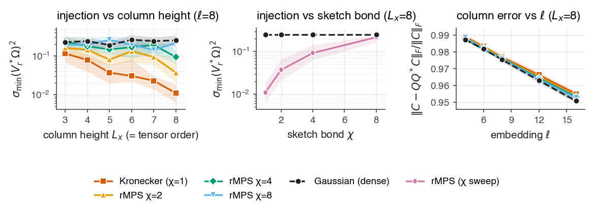
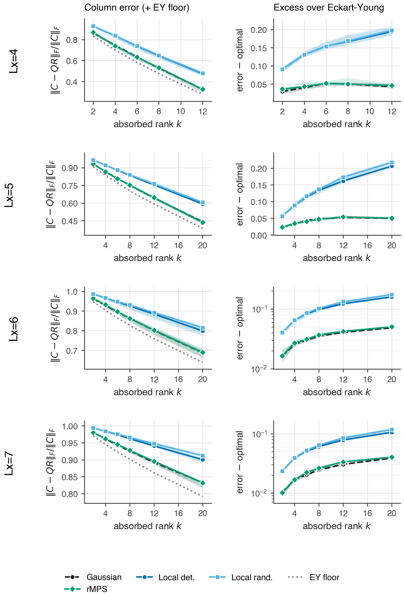
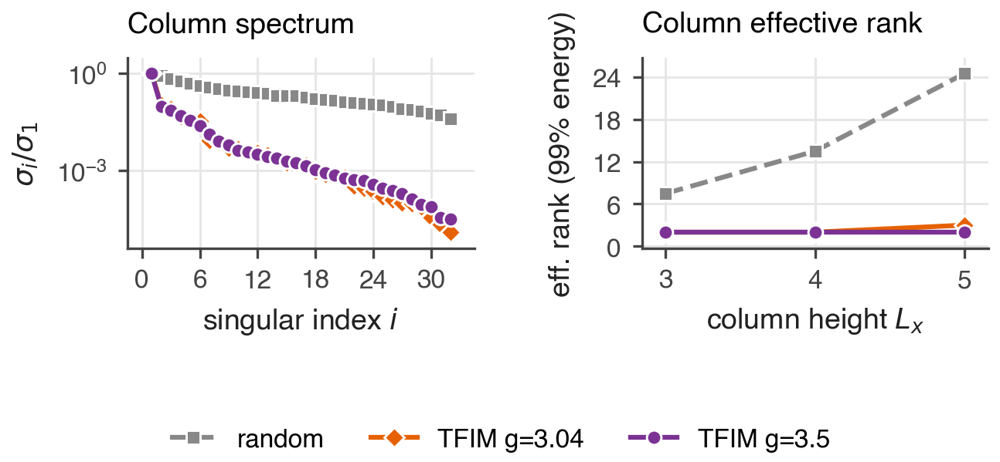
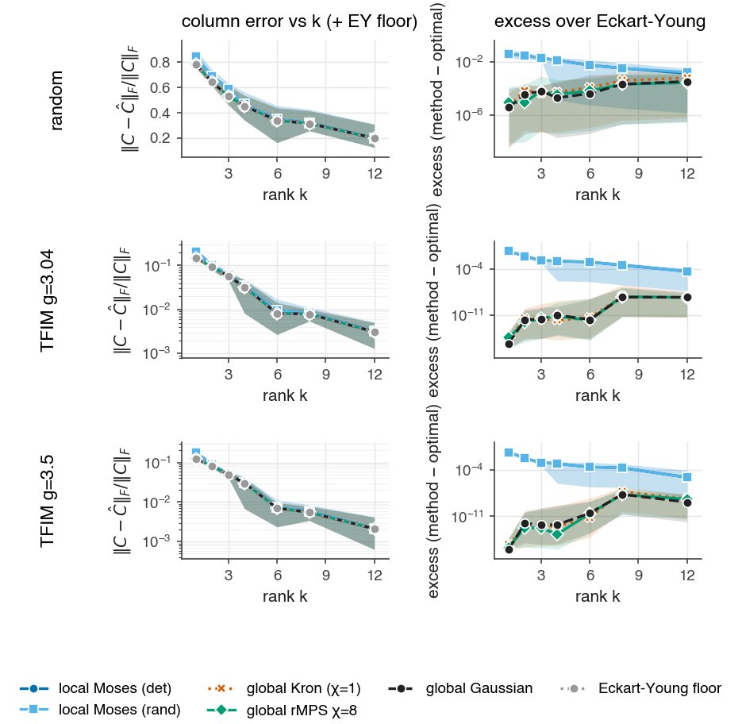
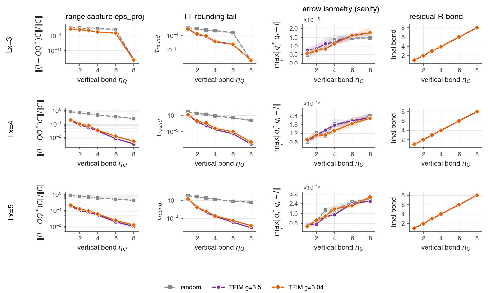

# Global rMPS-sketched column QR for the Moses move — Phase-1 validation

**Idea.** Replace the block Moses move's *sequential local sweep* (split each row,
carry a residual up, peel an R-column sideways) with **one global randomized
column QR**. View the whole active column as a single linear map
`C_j : X_j → Y_j` (absorbed legs → retained legs); its exact factorization is
`C_j = Q_j R_j` with `Q_j` the new isometric column and `R_j` the residual
absorbed into the neighbour. Approximate it directly with a randomized range
finder using **random matrix product state (rMPS)** probes (Camaño–Epperly–Meyer–Tropp,
[`docs/rmps.pdf`](../docs/rmps.pdf)):

```
Ω  : rMPS / Gaussian test matrix over the absorbed legs       (sketch bond χ_sk)
Y  = C_j Ω            (ℓ matrix–MPS products = the paper's access model)
Q  = orth(Y)          (the new isometric column)
Ĉ  = Q (Q* C_j)       (rank-ℓ column approximation;  R = Q* C_j)
```

This is a **mathematical-validation** suite on tiny *materialized* columns. The
library is built so a real isoTNS column — which, once its top/bottom environment
is contracted, *is* an MPO from absorbed to retained legs — reuses the same code by
swapping one constructor. Figures live in
[`figures/column_sketch/`](figures/column_sketch/).

## The math, briefly

- **rMPS (Def. 1.1).** A probe `ω ∈ F^{d_1·…·d_t}` is an MPS with iid Gaussian
  cores, per-core variance `1/χ_sk` (interior) and `1/√χ_sk` (boundary). This makes
  it **isotropic**, `E[ωω*] = I`, so it stands in for a dense Gaussian probe. The
  *sketch bond* `χ_sk` is the one reliability knob (the paper's `χ`, renamed to avoid
  colliding with the isoTNS horizontal bond).
- **The thesis.** rMPS behaves like Gaussian **iff `χ_sk ≳ t`** (the tensor order =
  column height `Lx`). The degenerate `χ_sk = 1` is a Gaussian-Kronecker / Khatri–Rao
  vector `ω = g_1 ⊗ … ⊗ g_t`, which fails by *overwhelming orthogonality*
  `|⟨x,ω⟩|² ≤ C^{-t}‖x‖²`.
- **OSI diagnostic (sec. 5.2).** `σ_min(V_r* Ω)²` — the *oblivious subspace injection*
  injectivity of the probe on the top-`r` right singular subspace of `C_j`. `≳ ½`
  means a good embedding; it is the sharp leading indicator of probe quality.
- **Guarantee (Thm 5.8).** With `Q = orth(C Ω)` and `ℓ ≳ (a+b)r`,
  `‖C − QQ*C‖_F ≲ ‖C − ⟦C⟧_r‖_F` — the randomized column QR is within a constant of
  the Eckart–Young optimum.

## Result 1 — the `χ_sk ≳ Lx` thesis holds for the column move



The OSI `σ_min(V_r* Ω)²` (left) **collapses for Kronecker (χ=1)** from ~0.12 to
~0.012 over `Lx = 3 → 8` — heading to zero, exactly the overwhelming-orthogonality
failure — while the dense Gaussian stays flat (~0.25) and **rMPS interpolates upward
with χ_sk**. The middle panel shows the climb from the Kronecker floor toward the
Gaussian reference as `χ_sk` grows at fixed `Lx`. The right panel (column error vs
`ℓ`) is probe-independent here: on these near-flat-spectrum columns the QB error is
set by the spectral tail, not the probe.

## Result 2 — global sketch vs the sequential local Moses



On the *same* column at matched absorbed rank `k`, the **global flat-rank sketch hugs
the Eckart–Young floor and is ~2.6–4× closer to optimal** (excess panel) than the
greedy sequential local Moses. Within the global family, **rMPS (χ≥2) matches the
dense Gaussian**; Kronecker (χ=1) begins to lag as `Lx` grows. Randomizing the local
SVDs is accuracy-neutral (`local-det ≈ local-rand`). Every method produces a genuinely
isometric column (defect ~1e-14). The global move uses **one** range-finder primitive
vs the local sweep's **`Lx`** sequential SVDs; wall-clock is a *labeled secondary*
panel — **no end-to-end speedup is claimed** (per the standing cost-model rule, that
needs the full matrix-free algorithm including absorption).

[Per-`Lx` detail](figures/column_sketch/exp01-materialized-detail.png): column error,
excess over rank-`r`, OSI vs `χ`, and the isometry defect (≈1e-14 everywhere).

## Result 3 (Stage 0) — real isoPEPS columns: structured vs random

The synthetic study used a worst-case caveat: *random* columns are nearly full-rank, so the
global sketch can't help there — but a *physical* (area-law) column might be low-rank, which is
the whole bet. Stage 0 tests it on **real quimb isoTNS states**. `column/from_quimb.py` extracts
the genuine whole-column map `C_j` that the block Moses move factors (validated below), for a
2D **transverse-field Ising ground state** (imaginary-time TEBD2, the rMPS paper's model, now in
2D) vs a **random isoTNS** — same bond budget (χ=8, η=4).



The orthogonality-center column's singular spectrum **decays sharply for the physical state and is
near-flat for random** (left). The effective rank (energy to 99%) is **~2 for TFIM vs ~14–25 for
random**, and — the two checks I was most worried about — the gap **survives criticality** (g=3.04
≈ g=3.5) and **widens with `Lx`** (random saturates the `d^Lx` codomain cap; TFIM stays ~constant,
area-law). Truncation to η=4 is **lossless for TFIM (~1.0) but increasingly lossy for random
(0.93→0.64)**. A gauge-free cross-check on the matrix the move *actually* truncates (svd2) reproduces
the gap (random ~18, TFIM ~2–4).

**This is the green-light:** physical columns have the low-effective-rank structure the global sketch
needs, exactly where random ones don't. **Validated** by two adversarial verifiers running live probes:
the deferred **gate 3** confirmed `range(orth(C_j))` equals the lossless move's new isometric column to
`4e-16` (it is the genuine object); the η-budget is fair (force-matching random's vertical bonds leaves
its rank unchanged); and g=3.04 is converged to 0.087% of exact ED with rank still 2 at doubled η.

**Caveats carried forward (from the adversarial pass):** "rank ~2" is **spectral decay / low effective
rank**, not mathematical rank (the matrix is full-rank; its *spectrum* collapses). It is the **boundary
orthogonality-center column** (codomain = physical); interior columns differ. `random_isotns` is the
**maximal-hardness** reference (it brackets the endpoints; intermediate physically-hard states — e.g.
time-evolved — are untested). The `Lx`-growth is "random saturates the `d^Lx` cap" over 3 points, not a
fitted volume law. These refine the framing; none overturns the green-light.

## Result 4 (Stage 1) — global vs local on real columns: accuracy ties, the win is cost

A theory review reframed the thesis. We are **not** sketching to enforce the isoPEPS isometry or
to be more accurate than Moses. We sketch to make the otherwise-intractable *whole-column* QR
tractable; an **arrow-compatible TT-SVD sweep** on the sampled range then turns it into a genuinely
isometric isoPEPS column (each core `q_i*q_i=I` — the arrows). The honest thesis:

> *a global range finder gives the **same** physical accuracy as the Moses move at **lower
> algorithmic cost**, provided the sampled range rounds to a **low-bond isometric column**.*

**Accuracy ties (exp05).** On the real extracted column `C_j`, at matched output rank, global
(oversampled) sits exactly at Eckart–Young while the greedy local Moses sweep carries a small excess
(~10⁻³–10⁻⁵ for TFIM) — both near-optimal, total error dominated by the shared EY floor.



The key correction: our synthetic Result 2 ("global beats local 2.6–4×") was an **artifact of
non-canonical synthetic columns**. Real isoTNS columns are MPS-*canonical* (low local-TN-rank), so
the local sweep is already near-optimal and there is no flat-rank-vs-TN-rank gap for global to
exploit. **Accuracy is not the deciding axis.**

**Feasibility holds (exp06).** The structured QR (`column/structured_qr.py`) rounds the *physical*
column's sampled range into a **low-bond isometric column at the EY floor** — `eps_proj ≈ 5%` at
vertical bond 4, `≈1%` at 8 — with the **arrows preserved to 3e-15** at every bond. A random column
does not round cheaply (45–90%). So the "low-bond isometric" clause of the thesis is satisfied for
physical columns.



**The cost case (first read).** The variational **disentangler is 86% of the local move's SVD work**
(12 of 19 SVDs per column; the Ndis-iteration alternating minimization at each site). The global
sketch **eliminates it** — ~ℓ matrix–MPS products + Lx TT-QR SVDs, no disentangler — and still gets a
small carried `R`-bond *for free* because the physical column's flat rank is low (Stage 0). A full
implementation-free FLOP tally of *both* sides (and the R-column absorption) is the natural next
experiment, but the structural case is clear: global trades the move's dominant cost (the
disentangler) for a cheap one-shot range capture.

**Stage-1 verdict:** accuracy ≈ tie (both near-optimal); the structured QR produces valid low-bond
isometric columns; the disentangler — 86% of the local SVD work — is what the global move stands to
remove. The project is now squarely a **cost** story, and its feasibility clause holds.

## Honest assessment — what we have and have not shown

**Solidly established.** (1) The machinery is *correct*: rMPS isotropy holds, `χ_sk=1`
is the Kronecker vector exactly, the matrix-free MPO–MPS access matches the dense
materialization to 3e-16, Gaussian recovers full rank to 1e-15, `Q` is always
isometric. (2) We *faithfully reproduce the paper's central thesis in the column-move
setting* — the OSI law `χ_sk ≳ Lx` (Result 1). This confirms rMPS is the right probe
object for the Moses column.

**Suggestive but qualified.** The "global beats local by 2.6–4×" result (Result 2) is
correct as computed, but it partly reflects a *generic* fact — an optimal low-rank
projection beats a greedy sequential one for any matrix — and it ignores the cost the
global method must pay that the local one does not: re-expressing the dense `Q` as a
low-bond column tensor network. So it establishes the **precondition** ("the column
range is better captured globally") but not that the global *method* wins end to end.

**Not yet shown.** (a) That rMPS's advantage over Kronecker *matters for the task* at
reachable sizes — at `Lx ≤ 8` the downstream column error is the same for Kron, rMPS,
and Gaussian; oversampling washes out the injectivity gap. We see the early-warning
signal (OSI), not the failure it warns of; the catastrophic Kronecker blowup is the
large-`Lx` regime (`n ≈ 50–70` in the paper) that materialization cannot reach. (b)
**The decisive question** (briefing sec. 8): does `range(C_j Ω)` round into a
*low-bond* isometric column without losing the gain? We built the seam
(`sampled_bond_growth` shows the pre-rounding bond is exactly `D·χ_sk`) but have not
answered it. (c) Anything about *real* isoTNS columns — all synthetic. (d) Any speedup.

**Verdict.** A clean Phase-1 validation: the idea is mathematically sound and the
tooling is real-experiment-ready. The single most important methodological conclusion
is almost negative — *the materialized validation cannot settle the question*, because
the interesting physics lives at `Lx ≫ 8`. The next step is therefore not more sweeps
but the MPS-native Gram–QR (matrix-free Phase 3) that reaches that regime.

## Code

- `src/rand_isopeps/linalg/rmps_sketch.py` — rMPS probes (Def. 1.1); wired into `SketchSpec(kind="rmps")`.
- `src/rand_isopeps/column/operator.py` — `ColumnOperator` access seam (`.materialize()` + matrix-free `.matvec_mps()`).
- `src/rand_isopeps/column/global_range.py` — `global_column_range` (errors, excess, isometry, OSI) + `sampled_bond_growth`.
- `src/rand_isopeps/column/local_moses.py` — `local_column_qr` (sequential local baseline).
- `experiments/column_sketch/` — `exp01` (Phase 1+2), `exp02` (Phase 4), `curate_figures.py`, README.
- Tests: `tests/test_rmps_sketch.py`, `tests/test_column_global_range.py` (full suite 43 pass).
