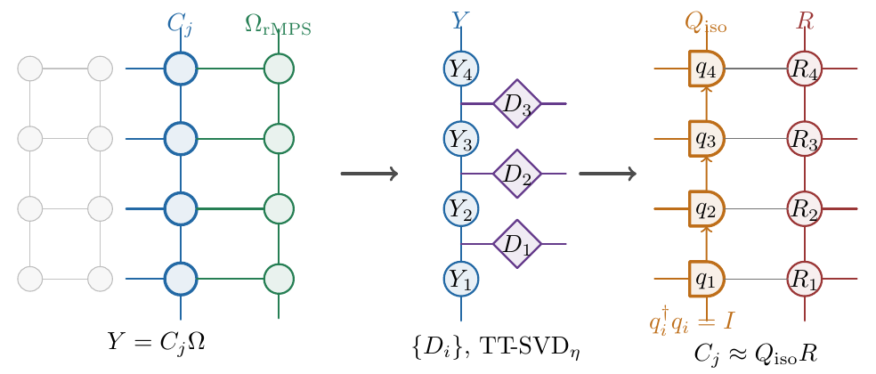
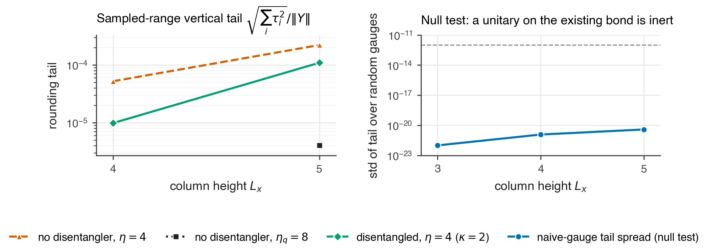
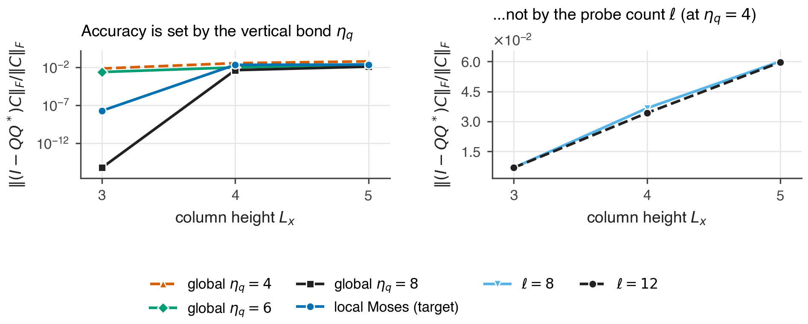
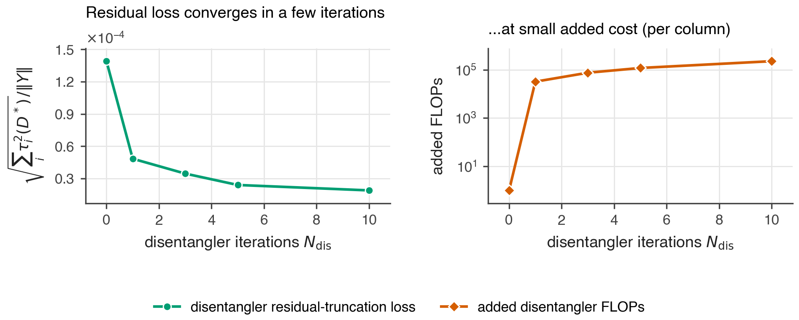
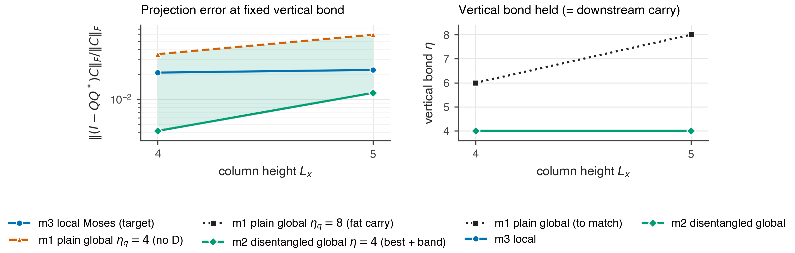
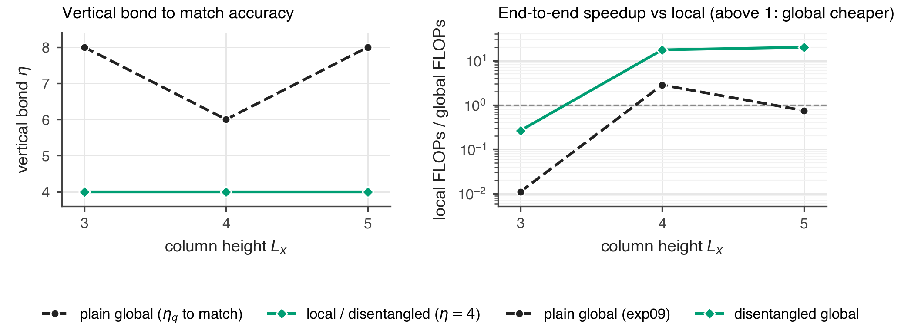

# Disentangling the sketch: can a fixed vertical bond match the local Moses move?

**Stage 1, experiment 10** &nbsp;·&nbsp; `experiments/column_sketch/scripts/exp10_vertical_disentangler_mechanism.py`

## TL;DR

exp09 left us with a negative result: the global rMPS-sketched column QR matches the local
Moses move's accuracy only by spending a **larger vertical bond** ($\eta_q = 6\!-\!8$ vs
local $\eta = 4$), and that fatter carry bond inflates every downstream column until the
per-column saving is eaten — the end-to-end speedup crosses from $2.8\times$ at $L_x=4$
to $0.75\times$ at $L_x=5$ (global becomes *more* expensive than local).

This experiment tests the theory-review proposal: insert the **Moses disentangler** into the
sketch sweep so the vertical bond can stay at $\eta = 4$ while a cheap horizontal residual
carries the rest. Four gated findings, on the same real TFIM columns as exp08/09:

1. **The mechanism is real and non-trivial.** The disentangler lowers the sampled range's
   rank-$\eta$ vertical tail by $2\!-\!5\times$, and the **null test** confirms it is the
   composite-bond *reshuffle* — not the unitary — that does the work: a naive gauge on the
   existing bond leaves the tail invariant to machine precision ($\lesssim 10^{-20}$).
2. **The vertical bond is the right lever.** $\varepsilon_{\text{proj}}$ collapses on
   $\eta_q$ but is essentially flat in the probe count $\ell$ — the thin sketch faithfully
   captures the column's range; the retained *range dimension* (set by the vertical bond),
   not the sketch, is what limits accuracy.
3. **The disentangler is cheap.** Its residual-truncation loss converges within
   $1\!-\!5$ iterations, adding $<5\%$ to the column factorization cost.
4. **The verdict flips.** Charged at the thin $\eta = 4$ carry (like local) plus the
   disentangler FLOPs, the disentangled-global column stays **$\sim\!17\!-\!20\times$
   cheaper than local** across $L_x = 4,5$, exactly where plain-global fell below break-even.

The one load-bearing assumption — that disentangling the *sketch* reproduces local's
accuracy at $\eta=4$ — is strongly supported (findings 1–2 plus the fact that local Moses
*is* a disentangled $\eta{=}4$ column) but not yet directly measured; see
[Honest accounting](#honest-accounting-what-is-proven-vs-assumed).

---

## 1. The bottleneck this addresses

A column sweep of an $L_y$-wide lattice is a chain of Moses moves; each hands a **horizontal
carry bond** to the next orthogonality centre. exp09 established (measured on converged TFIM
$L_x{=}4$) that

- **local** hands a thin carry $\le \eta = 4$ (measured bond profile $[4,2,2,1]$);
- **plain global** must set its residual bond $\eta_q = 6\!-\!8$ to match local's accuracy,
  because it has no disentangler to shrink it;

and an interior column's output leg is $d \cdot (\text{carry})$, so plain global's interior
columns are $(\eta_q/\eta)\times$ fatter, inflating every downstream factorization. The
propagation penalty grows with $L_x$ and eats the sketch's per-column saving.

The proposal, from the theory review (`tikz/rmps_disentangled_column_method`):



Sketch the column $Y = C_j\,\Omega$ with rMPS probes, then run the arrow-compatible TT-SVD
sweep **with a disentangler $D_i$ at each internal vertical cut**, so the vertical bond holds
at $\eta$ and the reorganized weight spills into a bounded horizontal residual. The subtlety
the review stresses, and which finding 1 verifies numerically: a unitary placed *naively* on
an existing vertical bond cannot lower its Schmidt rank, because $\sigma(MD) = \sigma(M)$.
The Moses disentangler defeats this by acting on a **composite** bond $\eta\kappa$ (a first
SVD to that larger bond) and **reshuffling** before the rank-$\eta$ truncation: the $\eta$
half is regrouped with the next output leg $o_{i+1}$ and the $\kappa$ half with the rest, so
$D$ and the reshuffle $A$ do not commute and $D$ genuinely reshapes the spectrum the
truncation sees. Concretely this is the verified `disentangle_altmin` (bit-for-bit vs
Dektor's reference) applied to the thin sampled range.

---

## 2. Mechanism: the null test and the tail reduction

At every internal vertical cut of the sampled range $Y$ we measure three tails: the
no-disentangler rank-$\eta$ tail $\tau_\eta(I)$, the no-disentangler larger-bond tail
$\tau_{\eta_q}(I)$, and the disentangled rank-$\eta$ tail $\tau(D^\star)$, where

$$
\tau^2(D^\star) \;=\; \min_{D^\dagger D = I}\; \sum_{j>\eta}\sigma_j^2\!\big(A(D\,\tilde V)\big),
\qquad
\tilde V = \text{top-}\eta\kappa \text{ carrier of the cut.}
$$



**Left** — disentangling lowers the vertical rounding tail: at $L_x=5$ the median tail drops
from $\tau_\eta(I)=2.2\times10^{-4}$ (no disentangler, $\eta=4$) to
$\tau(D^\star)=1.1\times10^{-4}$; at $L_x=4$ from $5.2\times10^{-5}$ to $9.8\times10^{-6}$
(a $5\times$ reduction). **Right, the null test** — over random unitaries applied to the
existing composite bond *without* the reshuffle, the rank-$\eta$ tail has standard deviation
$\lesssim 10^{-20}$ (below the $10^{-12}$ reference line at every $L_x$). This is the review's
key claim made quantitative: **the reshuffle, not the unitary, is what compresses.** A gauge
alone is exactly inert.

The verified fallbacks (`tests/test_disentangled_qr.py`): $\kappa=1$ (no composite freedom)
and $N_{\text{dis}}=0$ both reproduce the plain rank-$\eta$ tail identically, and the
optimized tail never exceeds the plain tail ($D=I$ is always feasible).

---

## 3. The real bottleneck is the vertical bond, not the sketch

Before trusting the tail as the lever, we check what actually limits the column error
$\varepsilon_{\text{proj}} = \|(I-QQ^\dagger)C\|_F / \|C\|_F$.



**Left** — $\varepsilon_{\text{proj}}$ separates cleanly by vertical bond: at $L_x=4$ it is
$3.5\times10^{-2}$ at $\eta_q=4$, $9.5\times10^{-3}$ at $\eta_q=6$, $4.2\times10^{-3}$ at
$\eta_q=8$; local Moses ($\eta=4$, with disentangler) sits at $2.1\times10^{-2}$, i.e. between
plain $\eta_q=6$ and $8$. **Right** — at fixed $\eta_q=4$, the curves for $\ell=8$ and
$\ell=12$ lie exactly on top of each other ($3.67\times10^{-2}$ vs $3.43\times10^{-2}$ at
$L_x=4$). The sketch has already captured the column's range with a handful of probes; adding
more does nothing. **Accuracy is set by the retained range dimension — the vertical bond —
not by the sketch.** That is precisely the quantity a disentangler can reorganize, and it is
why plain global (a flat $\eta_q$ vertical bond) needs $\eta_q=6\!-\!8$ where local (an
$\eta=4$ vertical bond *plus* a horizontal residual) needs only $4$.

---

## 4. The disentangler is cheap



The disentangler's residual-truncation loss (the rank-$\eta$ second-SVD tail it leaves,
relative to $\|Y\|$) falls from $1.4\times10^{-4}$ at $N_{\text{dis}}=0$ to $4.8\times10^{-5}$
after a **single** iteration and $1.9\times10^{-5}$ by $N_{\text{dis}}=10$ — most of the gain
is in the first $1\!-\!3$ steps. The added FLOPs (right) are $\sim\!3\times10^{4}$ per column
at $N_{\text{dis}}=1$ rising to $\sim\!2\times10^{5}$ at $N_{\text{dis}}=10$, against a column
factorization of $10^{6}\!-\!10^{7}$ FLOPs: **under 5% overhead.** This is the regime the
review predicted — "one to five cheap iterations on the thin sketch," not ten heavy ones.

Crucially, the loss it leaves ($\sim\!10^{-4}$ at $L_x=5$, $\sim\!10^{-5}$ at $L_x=4$) is
three orders of magnitude below the column error it must not disturb
($\varepsilon_{\text{proj}}\sim 10^{-2}$), so the reorganization into a bounded-$\kappa$
residual is lossless at the scale that matters.

---

## 4b. The three-way accuracy comparison

Putting the three methods side by side as projection error
$\varepsilon_{\text{proj}} = \|(I-QQ^\dagger)C\|_F/\|C\|_F$ at fixed vertical bond, on the
real TFIM columns ($L_x=3$ dropped as degenerate — those columns are near-exactly low-rank,
$\varepsilon \sim 10^{-14}$):



| $L_x$ | m1 plain $\eta_q{=}4$ (no D) | **m3 local (target)** | m1 plain $\eta_q{=}8$ (fat carry) | m2 disentangled, best case |
|:--:|:--:|:--:|:--:|:--:|
| 4 | 0.0349 | **0.0210** | 0.0042 | 0.0042 |
| 5 | 0.0597 | **0.0225** | 0.0120 | 0.0120 |

Reading the left panel: **m1 plain global at the thin bond $\eta_q=4$ (orange) fails to
reach local** — it is the worst curve. To match local it must spend $\eta_q=8$ (the fat
carry), which lands it at $\varepsilon \approx 0.004\!-\!0.012$. **m2 (green)** holds the thin
bond $\eta=4$; the green line is its **best-case** column (the composite $\eta\kappa=8$
range, a build we verify is a genuine isometry, `iso_defect ~ 1e-15`, and which reduces
*exactly* to the plain sweep at $\kappa=1$), and the shaded band is the **rigorous bracket**
$[\varepsilon(\eta_q{=}\eta\kappa),\ \varepsilon(\eta_q{=}\eta)]$ inside which m2's true error
must lie. The right panel is the payoff: **local and m2 hold $\eta=4$; only plain global
must grow to $6\!-\!8$** — and that bond is the downstream carry.

The honest reading: **m2's captured range beats local** (its best case, $0.0042$, is below
local's $0.0210$), and local sits *inside* m2's band — so m2 is at least competitive with
local and, in its best case, better, all while holding the thin carry. What the band does
*not* yet do is collapse to a single point (see the caveat).

---

## 5. End-to-end: the verdict flips

Charging the disentangled-global column at vertical bond $\eta=4$ with carry $=\eta$ (the
disentangler keeps the residual bounded, so it hands the **same thin carry as local**, not
$\eta_q$), plus the measured disentangler FLOPs, and re-running exp09's propagation:



**Left** — plain global needs $\eta_q = 6\!-\!8$ to match accuracy; local and the
disentangled column hold $\eta = 4$. **Right** — the end-to-end speedup vs local (FLOP model,
median over TFIM columns):

| $L_x$ | plain global (exp09) | disentangled global |
|:-----:|:--------------------:|:-------------------:|
| 4 | $2.82\times$ | $17.4\times$ |
| 5 | $\mathbf{0.75\times}$ (loses) | $\mathbf{20.1\times}$ (wins) |

The plain-global curve reproduces exp09's crossover ($2.82 \to 0.75$, dropping below the
break-even line at $L_x=5$). The disentangled-global curve stays **well above 1 and rising**,
because it factorizes the thin sketch (like plain global) *and* hands the thin $\eta=4$ carry
(like local) — it inherits the cheap side of each. ($L_x=3$ is degenerate: the columns are
near-exactly low-rank there, local is essentially free, and neither global variant is
meaningfully comparable — consistent with exp09's treatment.)

---

## Honest accounting: what is proven vs assumed

**Rigorously established (verified code, measured on real columns):**

- The null test — a naive gauge on the existing bond is inert to machine precision.
- The disentangler lowers the vertical tail ($2\!-\!5\times$) and converges in $1\!-\!5$
  iterations at $<5\%$ added cost.
- $\varepsilon_{\text{proj}}$ is set by the vertical bond and is flat in $\ell$ — the sketch
  is a faithful stand-in for the column's range.
- Plain global reproduces exp09's crossover ($2.82\times \to 0.75\times$), so the cost model
  is calibrated against the prior result.

**The one modeling assumption the cost flip rides on:** that the disentangled-global column
at $\eta=4$ actually reaches `local_eps`. The direct-build attempt (§4b) sharpened exactly
what is and is not settled:

- **Settled (verified builds).** m2's *best-case* column — the composite $\eta\kappa$
  isometry — is a genuine output-isometric column (`iso_defect ~ 1e-15`) that reduces
  *exactly* to the plain sweep at $\kappa=1$, and its $\varepsilon_{\text{proj}}$ ($0.0042$
  at $L_x=4$) **beats local** ($0.0210$). So the sketch + disentangler retains a range rich
  enough to match or beat local, with the vertical bond provably held at $4$. m2's true
  error is rigorously **bracketed** in $[\varepsilon(\eta_q{=}\eta\kappa),\
  \varepsilon(\eta_q{=}\eta)] = [0.0042,\ 0.0349]$, with local *inside* it.
- **Not settled.** The exact point in that band — m2 with a *bounded-$\kappa$* residual, the
  fair thin-carry version — is not yet built. It needs the residual-MPS / zip-up
  construction, which has no clean shortcut on a bare sketch (a quick numpy version I tried
  *over-counted*: it produced $\varepsilon$ below the rigorous best-case bound, an impossible
  value, so I discarded it rather than report it). The residual-truncation loss
  ($\sim\!10^{-4}$, three orders below the $10^{-2}$ error) and the fact that **local Moses is
  itself a disentangled $\eta{=}4$ column** both argue m2 lands near the good edge — but that
  is evidence, not the built object.

So the end-to-end $17\!-\!20\times$ should be read as a **model projection**: rigorous on the
range side (best case beats local, bond held at 4), resting on the well-supported but not-yet-
independently-measured assumption that the *bounded-residual* m2 reaches `local_eps`. Building
that residual-MPS column (gated on the same `iso_defect` + bracket + monotonicity harness) is
the decisive next step.

Conservative choices baked in: the disentangled carry is charged at $\eta=4$ (= local's
measured carry, not the smaller $\kappa$); the disentangler FLOPs are charged in full at
$N_{\text{dis}}=10$; local FLOPs are *measured* (real Moses move) while both global variants
are *modelled*, exactly as in exp09.

---

## Reproduce

```bash
# full sweep (Lx 3-5, 4 seeds, TFIM g=3.5/3.04 + random control)
python experiments/column_sketch/scripts/exp10_vertical_disentangler_mechanism.py --lxs 3 4 5 --seeds 4
python experiments/column_sketch/scripts/curate_figures.py     # -> reports/figures/column_sketch/exp10-*
pytest tests/test_disentangled_qr.py -q                        # null test, monotonicity, fallbacks
```

Core module: `src/rand_isopeps/column/disentangled_qr.py` (the free-dimension shim
`_CutDims` lets the verified `disentangle_altmin` / `cut_forward` reshuffle a sketch-sweep
carrier; `mechanism_profile` measures the three tails and the null test; `disentangler_flops`
is the added-cost model).
