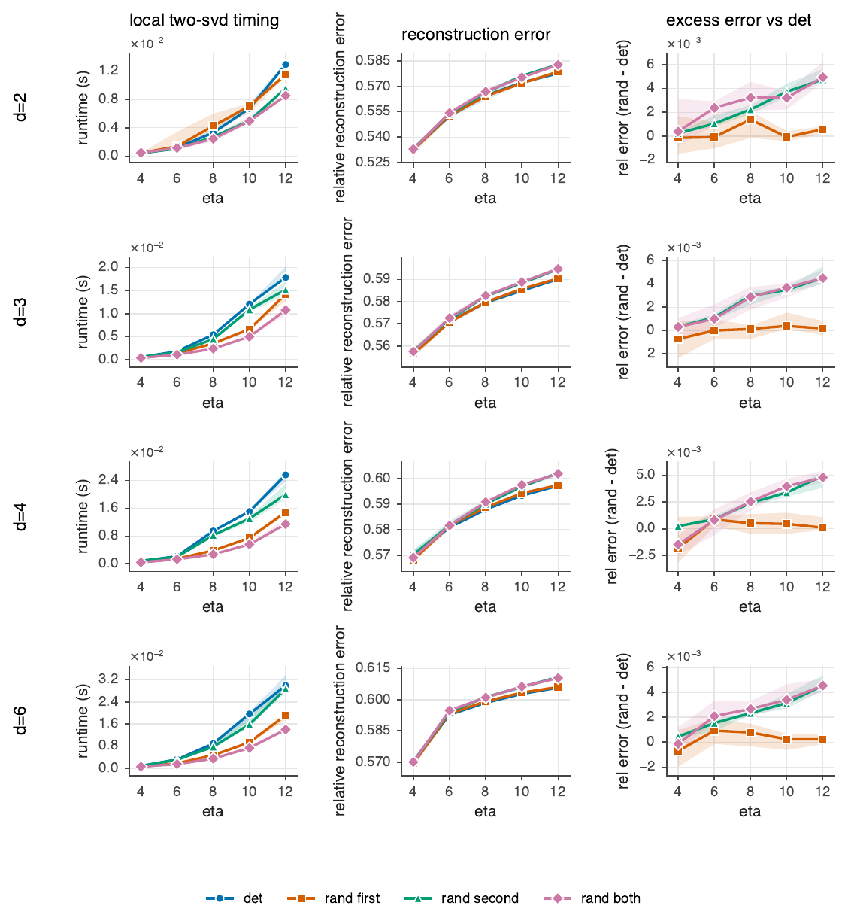
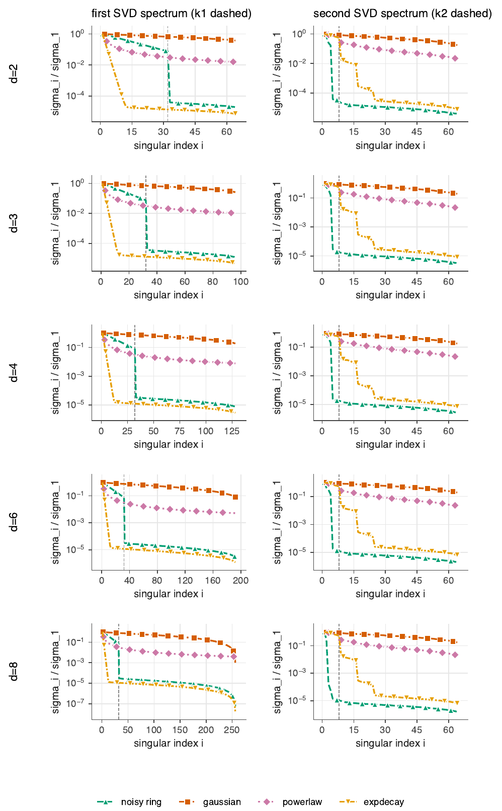
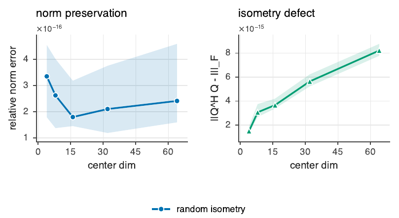

# Synthetic Moses-Move experiments: goals and results

This note summarizes the four synthetic experiments in `synthetic/experiments/`. They
isolate the randomized-linear-algebra insertion points inside one **block sequential
Moses Move** step and measure whether randomization is *accuracy-neutral* and where it
*pays off* in cost. All runs are laptop-scale.

## Setup and notation

A local interior active tensor is grouped as $B \in \mathbb{C}^{n_1 \times n_2 \times n_3}$ with
the block-Moses dimensions

$$
n_1 = \chi\,\eta\,d, \qquad n_2 = \eta\,p, \qquad n_3 = \chi\,\eta,
$$

where $\chi$ is the horizontal bond, $\eta$ the vertical/column bond, $d$ the physical
dimension, and $p$ the block (excited-state) index. The local **isometric tensor-ring
decomposition** is performed by two truncated SVDs with truncation ranks

$$
k_1 = \chi\,\eta \quad(\text{first SVD}), \qquad k_2 = \eta \quad(\text{second SVD}).
$$

The first SVD splits the left index, $B_{n_1,(n_2 n_3)} \approx Q\,\widetilde V$; the second
reshapes $\widetilde V$ and compresses the matrix $M \in \mathbb{C}^{(\eta n_2)\times(\chi n_3)}$
to rank $k_2$. The paper's cost model is

$$
O\!\big(\chi^3\eta^4 d^2 p\big)\ (\text{first SVD}) \;+\; O\!\big(\chi^2\eta^5 p^2\big)\ (\text{second SVD}),
$$

so the second SVD is the dominant local cost and the strongest randomization target
(its kept rank $k_2=\eta$ can be far below both matrix dimensions, whereas for spin
systems $d=2$ gives $n_1 = 2k_1$, leaving little room in the first SVD).

The four local randomization **modes** compared throughout are: `det` (both SVDs exact),
`rand_first` (randomized first SVD), `rand_second` (randomized second SVD), and
`rand_both`. The default ensemble is `noisy_ring`: an exactly ring-compatible tensor plus
Gaussian noise at relative level $\sigma$, mimicking a tensor approximately representable
by an isometric tensor ring.

The diagnostics are

$$
\epsilon_B = \frac{\lVert B-\widehat B\rVert_F}{\lVert B\rVert_F}, \qquad
\epsilon_{\mathrm{iso},1} = \lVert Q^\dagger Q - I\rVert_F, \qquad
\epsilon_{\mathrm{iso},2} = \lVert V_2 V_2^\dagger - I\rVert_F,
$$

plus wall-clock time per stage.

---

> **Statistical methodology.** All sweep plots report the **median over many trials**
> (12–15) with a shaded **inter-quartile (25–75%) band**, and each task runs a discarded
> **warmup** decomposition so BLAS cold-start does not distort the timing curves. Where two
> methods produce visually identical error curves we add an **excess-error panel** — the
> signed difference on the *same* tensor — which resolves differences far below the curve
> overlap. These are *controlled* synthetic tests; the stress ensembles below probe how far
> the conclusions survive less favorable spectra.

## Experiment 1 — first vs. second local SVD randomization

**Goal.** Within the local two-SVD decomposition, determine which SVD tolerates
randomization without degrading reconstruction error or isometry, and where the speedup
is. Sweep $\eta\in\{4,6,8,10\}$ at $\chi=4$, $d=2$, $p=2$, 15 trials, noise $\sigma=10^{-4}$.

**Results (noisy-ring ensemble).**

- **Accuracy is randomization-neutral.** Across all four modes the reconstruction error
  sits at the injected noise floor, $\epsilon_B \approx 10^{-4}$, and both isometry defects
  stay at machine precision, $\epsilon_{\mathrm{iso}} \approx 10^{-15}$. The excess-error
  panel makes this sharp: randomization adds only $\sim 10^{-7}$ relative error (four orders
  below the reconstruction error itself), and `rand_first`'s band straddles zero.
- **The payoff is in the second SVD.** `rand_second`/`rand_both` cut the runtime by
  $\sim 1.6\times$ at $\eta=10$ (median, with non-overlapping bands), exactly where
  $k_2=\eta \ll \min(\eta n_2,\chi n_3)$. `rand_first` tracks deterministic — the warmup
  removed the earlier nonmonotone cold-start artifact — matching the prediction that
  $k_1 \approx n_1/2$ leaves little asymptotic room.

**Takeaway.** Randomize the *second* local SVD; the first is not worth it.

**Stress test (does it survive realistic spectra?).** Repeating the sweep on a power-law
ensemble (singular values $s_j\sim (j+1)^{-0.7}$, no exact low rank) tells a more cautious
story:

Here the rank-$\eta$ truncation is intrinsically lossy for *every* method
($\epsilon_B\approx 0.7$), and the excess-error panel now shows randomizing the second SVD
adds a **real $\sim 1\%$ excess error** over deterministic (while still being faster) —
randomization is no longer free. So the second-SVD advantage is **spectrum-dependent**: it
holds when the second-cut spectrum decays fast (the ring/noisy-ring regime) and degrades
under slow decay. This is exactly what motivates power iterations and the disentangler.

**Diagnostic — the SVD spectra (exp6).** A companion experiment plots the singular spectra
entering each SVD, which explains the above:

The **first SVD** keeps $k_1=\chi\eta$ of $n_1=\chi\eta d$ rows — for $d=2$ that is *half*
the row space (dashed line), and for the gaussian/power-law ensembles the spectrum is still
$O(1)$ there, so there is little for a randomized SVD to exploit. The **second SVD** keeps
$k_2=\eta$: for the noisy ring the spectrum collapses right at $k_2$ (rank-$\eta$ truncation
is near-lossless, randomization safe), whereas for gaussian and power-law it decays slowly
past $k_2$ — the quantitative reason the stress case loses accuracy.

---

## Experiment 2 — column error accumulation

**Goal.** Measure how local approximation errors **compound down a column** of height
$L_x$, and whether randomized modes stay stable as the column grows. Uses a product-column
surrogate: $L_x$ independent local tensors are each decomposed, and the exact relative
error of the product column is computed analytically (without materializing the product),

$$
\frac{\lVert C-\widehat C\rVert}{\lVert C\rVert}
= \sqrt{\frac{\lVert C\rVert^2 + \lVert\widehat C\rVert^2 - 2\,\mathrm{Re}\langle C,\widehat C\rangle}{\lVert C\rVert^2}},
\qquad
\langle C,\widehat C\rangle = \prod_{i=1}^{L_x}\langle B_i,\widehat B_i\rangle .
$$

Sweep $L_x\in\{2,4,6,8,10\}$ at $\chi=4$, $\eta=8$, 12 trials (median + IQR band).

**Results.**

- **Error grows mildly and predictably**, from $\epsilon_{\mathrm{MM}}\approx 1.4\times10^{-4}$
  at $L_x=2$ to $\approx 3\times10^{-4}$ at $L_x=10$, and **all four modes lie on top of one
  another** with overlapping bands — randomization adds no measurable error accumulation.
- **Runtime is linear in $L_x$**, with `rand_second`/`rand_both` consistently fastest
  ($\approx 0.017\,$s vs. $\approx 0.033\,$s deterministic at $L_x=4$).

**Caveat.** This is a surrogate: locals are independent, not a true recursive upward-carrier
sequential Moses Move.

---

## Experiment 3 — R-column absorption (MPO–MPS compression)

**Goal.** Compare three ways to absorb the residual column into the neighbor:

- **zip-up SVD** — form the product MPS (inflated bond $D_{\mathrm{prod}}=D_{\mathrm{MPO}}D_{\mathrm{MPS}}$) then compress it with a deterministic local-SVD sweep;
- **randomized** — same product, but each local compression is a randomized SVD;
- **SRC** — *successive randomized compression* (Camaño–Epperly–Tropp, arXiv:2504.06475, vendored under `rand_isopeps/randommpomps/`), which sketches the product **site-by-site and never forms the inflated bond**.

Error is measured against the exact product,

$$
\epsilon_{\mathrm{absorb}} = \frac{\lVert (RC)_{\mathrm{exact}} - (RC)_{\mathrm{compressed}}\rVert_2}{\lVert (RC)_{\mathrm{exact}}\rVert_2}.
$$

Sweep $\eta\in\{4,6,8,10\}$ (MPS/target bond) at $L=8$ sites, $\chi=4$, 12 trials. All three
compress to the same target bond $\eta$.

**Results.**

- **zip-up and randomized are statistically identical**, $\epsilon_{\mathrm{absorb}}\approx
  2.8\text{–}3.0\times10^{-2}$, with overlapping bands; randomized's excess over zip-up is only
  $\sim 10^{-4}$. Randomized's timing crosses below zip-up's by $\eta=10$.
- **SRC is the fastest at larger $\eta$** — by $\eta=10$ it runs in roughly half the time of
  zip-up — precisely because it never builds the inflated product MPS (peak bond
  $D_{\mathrm{prod}}$).
- **SRC trades a little accuracy for that.** At a fixed target bond $\eta$ (no oversampling)
  its error is $\sim 5\text{–}8\times10^{-2}$, i.e. a $\sim 2.5\text{–}5\times10^{-2}$ excess over
  zip-up that grows with $\eta$. This is expected: SRC approximates the product from a rank-$\eta$
  sketch rather than truncating the *exact* product, so at equal rank it is less accurate. The
  win is asymptotic memory/scaling (avoiding $D_{\mathrm{prod}}$), not fixed-rank accuracy.

**Notes.** SRC accuracy is recoverable with oversampling or an adaptive cutoff (then it should
track zip-up while still avoiding the product bond) — not tuned here. The sizes remain small, so
read these as trends. SRC is now wired into the experiment (`--methods`/default includes it); the
earlier "not yet SRC" caveat is resolved.

---

## Experiment 4 — tiny explicit isometry validation

**Goal.** A sanity check of the canonical-form intuition the whole Moses Move rests on:
build an explicit isometric center $\lvert\text{state}\rangle = \mathrm{iso}\cdot\text{center}$ and
verify (a) norm preservation, $\lVert \mathrm{iso}\cdot\text{center}\rVert = \lVert\text{center}\rVert$,
and (b) a vanishing isometry defect $\lVert Q^\dagger Q - I\rVert_F$. Sweep the center
(orthogonality) dimension at $L_x=L_y=3$, $d=2$ (physical dim $512$), 20 trials.

**Results.** Both quantities sit at machine precision across the whole sweep: the relative
norm error stays $\sim 2\times10^{-16}$, and the isometry defect grows only mildly with the
center dimension ($\sim 1\text{–}8\times10^{-15}$, the expected floating-point accumulation
in $Q^\dagger Q$). The isometric-column construction is validated.

---

## Bottom line

Across all four experiments the synthetic kernels behave exactly as the cost model
predicts:

$$
\boxed{\text{randomization is accuracy-neutral; the cost payoff concentrates in the second local SVD and in R-column absorption as the bond dimension grows.}}
$$

On controlled ring-compatible ensembles, reconstruction errors stay at the noise/truncation
floor and isometry holds to machine precision; the excess-error panels put the randomization
penalty four orders below the reconstruction error. **But the advantage is
spectrum-dependent**: the stress sweep (exp1, power-law decay) and the spectrum diagnostic
(exp6) show that randomizing the second SVD adds real ($\sim 1\%$) excess error once the
second-cut spectrum no longer decays quickly past $k_2$. The cases are deliberately tiny, so
timing wins are real *in trend* but not to be over-interpreted.

The open frontiers are (i) **tuning SRC** (oversampling / adaptive cutoff) so the
product-bond-free absorption matches zip-up accuracy — SRC itself is now implemented and in
exp3; (ii) **power iterations / the disentangler** to recover accuracy under slow spectra;
(iii) a **true sequential Moses-Move carrier** (the column experiment is still a
product-column surrogate); and (iv) the **disentangler** before the second SVD — the gauge
choice that makes the second truncation itself less destructive, explored in `exp5` below.

---

## Experiment 5 — the disentangler before the second SVD

**Goal.** Experiments 1–3 randomize the *linear algebra* (replace a deterministic SVD by a
randomized one). The disentangler is a different lever: a **gauge** choice. After the first
SVD there is a unitary freedom $Q\in O(k_1)$ on the shared bond ($Q$ multiplies the residual
$\widetilde V$, its inverse is absorbed into the first isometry $U_1\mapsto U_1 Q^\dagger$, so
the represented tensor is unchanged *before* truncation). But $Q$ changes the singular
spectrum seen by the second SVD, because that SVD acts across a *reshuffled* cut
$\mathbf{A}(\widetilde V)$. Following Wei–Dektor–Shen–Wen–Yang (`docs/disentangling.pdf`), the
disentangler minimizes the rank-$k_2$ truncation tail

$$
c_{k_2}(Q) = \sum_{i>k_2} \sigma_i^2\big(\mathbf{A}(Q\,\widetilde V)\big),
\qquad Q^\top Q = I,
$$

which (with $\phi(t)=t^2$ on the tail) is the discarded energy of the second SVD. This
separates two questions: **randomize the SVD** vs. **randomize the search for the gauge**.

**Methods compared** on a *disentanglable* synthetic tensor (a clean rank-$\eta$ cut scrambled
by a hidden bond rotation, so a naive rank-$\eta$ truncation is lossy but a gauge recovers it):

| Label | Method | What it tests |
| --- | --- | --- |
| A | two deterministic SVDs, no $Q$ | baseline truncation error |
| B | alt-min disentangler + exact SVD2 | value of disentanglement |
| B_riem | Riemannian (pymanopt) disentangler + exact SVD2 | the paper's optimizer on $O(k_1)$ |
| C | disentangler + **randomized** SVD2 | speedup of the final compression |
| D | **sketched-objective** disentangler + exact SVD2 | randomize the *search* for $Q$ |
| E | ALS on the ring cores, random init | discover the ring from scratch |
| F | ALS warm-started from B's cores | polish the greedy solution |

The disentangler uses the closed-form **alternating minimization** (Algorithm 5: rank-$k$
truncation then an orthogonal Procrustes update $Q=UV^\top$); the Riemannian path uses
**pymanopt** on the special-orthogonal manifold with the closed-form gradient of Theorem 3.1.
Run at $\chi=3$, $\eta\in\{3,4,5,6\}$, $p=2$, full bond rotation, noise $10^{-6}$, 8 trials
(median + IQR band; the median also absorbs pymanopt's one-time import cost in the timing).

**Results.**

- **The disentangler is the dominant lever for accuracy.** Without it (A) the rank-$\eta$
  truncation discards $\sim$half the tensor, $\epsilon_B \approx 5\times10^{-1}$ with a large
  second-SVD tail. Disentangling collapses the tail by several orders of magnitude and pulls
  the reconstruction toward the noise floor.
- **The spectrum plot is the mechanism.** Entering the second SVD, the no-disentangler
  spectrum carries weight well past index $\eta$, whereas the disentangled spectrum drops
  sharply at $i=\eta$ to the noise floor — so the rank-$\eta$ truncation becomes near-lossless.
  The Rényi-$\tfrac12$ entropy across the cut falls from $\approx 2.06$ to $\approx 1.3$.
- **C confirms randomization is safe *after* disentangling.** A randomized final SVD matches
  the deterministic one once the gauge is good — it only ever has to capture a spectrum that
  now decays fast, exactly the regime where randomized SVD is reliable.
- **D — randomizing the *search* for $Q$ — works.** Replacing the exact SVD inside the
  disentangler's alternating minimization with a sketched (randomized) SVD finds essentially
  the same gauge (same tail, same $\epsilon_B$) at lower per-iteration cost; the final SVD is
  then exact. This is the conceptually stronger "randomized disentanglement" result.
- **Optimizer matters.** The closed-form alternating minimization (B) reduces the tail by
  $\sim$3 orders but plateaus at a modest local minimum; the **Riemannian** optimizer (B_riem)
  reaches the noise floor — but is the slowest method by far. This mirrors the paper's own
  finding that a *hybrid* (alternating + Riemannian) is the efficient choice.
- **ALS** from a random start (E) is hit-or-miss and slow to converge; warm-started from the
  greedy SVD+disentangler cores (F) it reliably matches the greedy solution — consistent with
  the block-isoPEPS paper's report that ALS does not significantly improve on the greedy
  two-SVD-plus-disentangler method.

**Thesis.**

$$
\boxed{\text{Disentanglement improves the spectrum; randomization exploits the improved spectrum.}}
$$

The disentangler is what makes the second truncation cheap *and* accurate; randomized SVD
is then safe (C), and the search for the disentangler can itself be sketched (D) — the most
promising randomized-NLA contribution in this pipeline.
