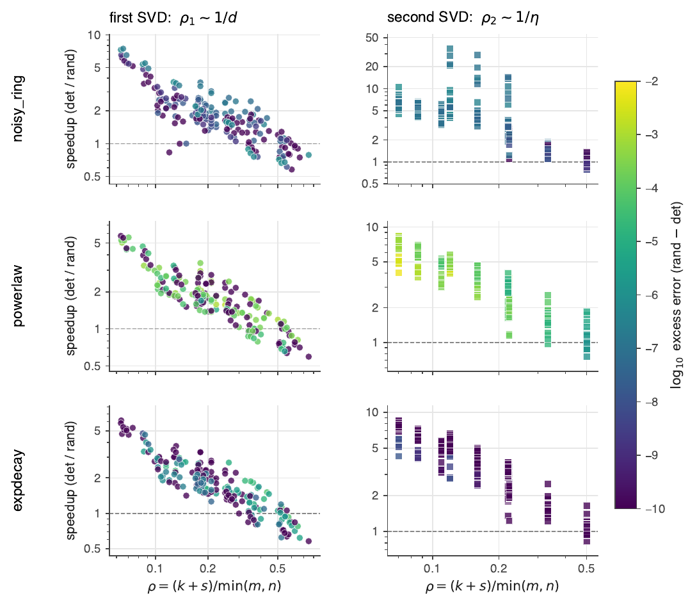
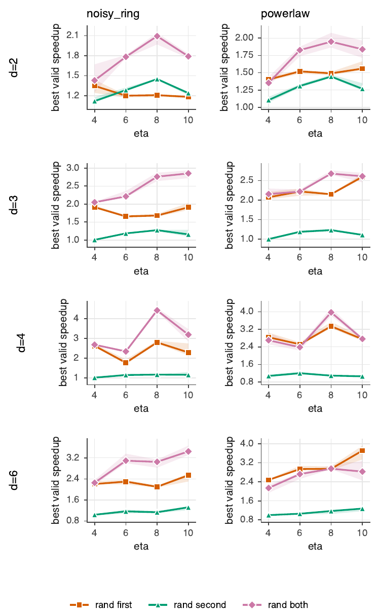
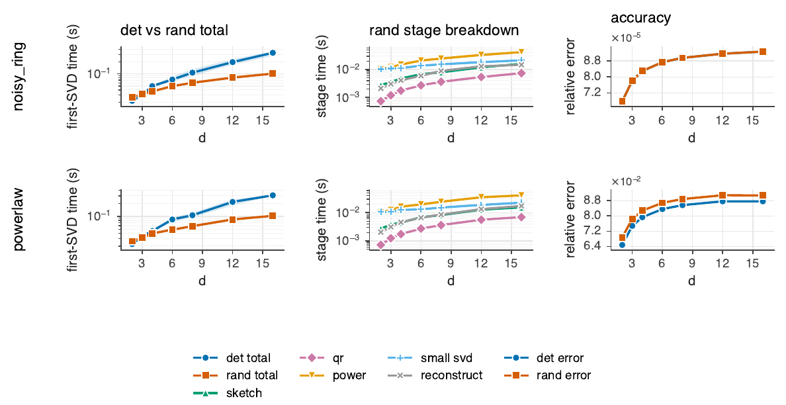
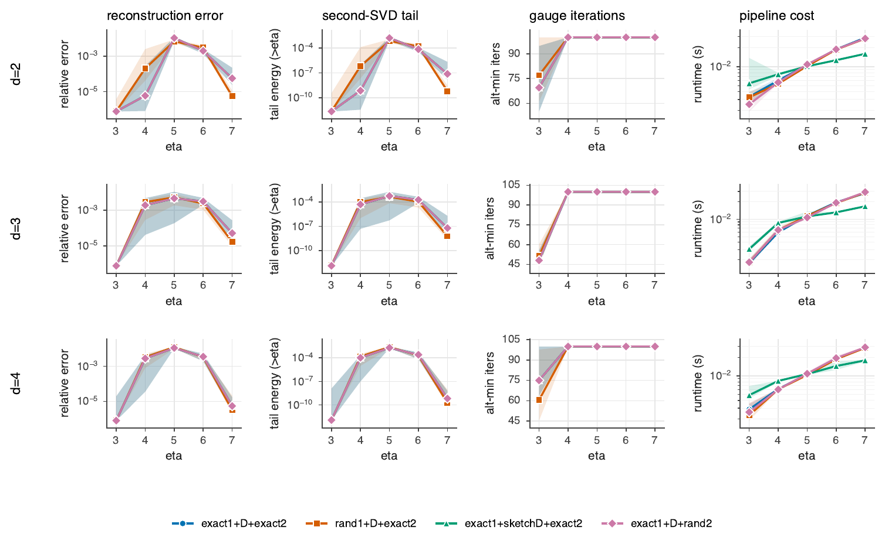
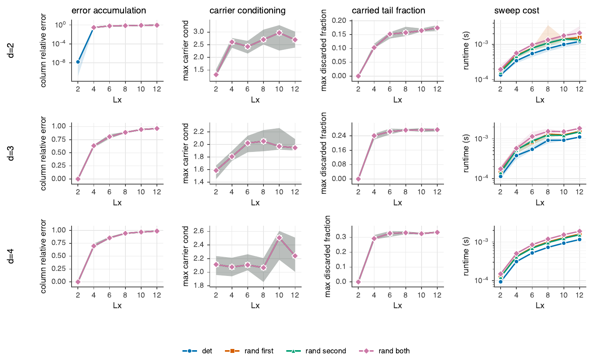

# Synthetic Moses-Move experiments: goals and results

This note summarizes the four synthetic experiments in `synthetic/experiments/`. They
isolate the randomized-linear-algebra insertion points inside one **block sequential
Moses Move** step and measure whether randomization is *accuracy-neutral* and where it
*pays off* in cost. All runs are laptop-scale.

## Setup and notation

A local interior active tensor is grouped as $B \in \mathbb{C}^{n_1 \times n_2 \times n_3}$ with
the block-Moses dimensions

$$
n_1 = \chi\,\eta\,d, \qquad n_2 = \eta\,p, \qquad n_3 = \chi\,\eta,
$$

where $\chi$ is the horizontal bond, $\eta$ the vertical/column bond, $d$ the physical
dimension, and $p$ the block (excited-state) index. The local **isometric tensor-ring
decomposition** is performed by two truncated SVDs with truncation ranks

$$
k_1 = \chi\,\eta \quad(\text{first SVD}), \qquad k_2 = \eta \quad(\text{second SVD}).
$$

The first SVD splits the left index, $B_{n_1,(n_2 n_3)} \approx Q\,\widetilde V$; the second
reshapes $\widetilde V$ and compresses the matrix $M \in \mathbb{C}^{(\eta n_2)\times(\chi n_3)}$
to rank $k_2$. The paper's cost model is

$$
O\!\big(\chi^3\eta^4 d^2 p\big)\ (\text{first SVD}) \;+\; O\!\big(\chi^2\eta^5 p^2\big)\ (\text{second SVD}),
$$

so the second SVD is the dominant local cost and the strongest randomization target
(its kept rank $k_2=\eta$ can be far below both matrix dimensions, whereas for spin
systems $d=2$ gives $n_1 = 2k_1$, leaving little room in the first SVD).

**The dimensionless rank fraction.** Whether a randomized SVD has *room* to win is
governed not by the spectrum alone but by the kept sketch size $\ell=k+s$
(oversampling $s$) as a fraction of the smaller matrix dimension,

$$
\rho = \frac{\ell}{\min(m,n)} = \frac{k+s}{\min(m,n)}.
$$

For the first SVD $\min(m_1,n_1)=\chi\eta d$ usually, so $\rho_1\approx \tfrac1d +
\tfrac{s}{\chi\eta d}\sim 1/d$: spin-$\tfrac12$ ($d=2$) keeps *half* the smaller
dimension, and only larger local spaces ($d=3,4,6,\dots$) shrink $\rho_1$ enough for
randomization to pay. For the second SVD $\rho_2\sim 1/\eta$, already small. This is
the central axis below: a randomized SVD becomes worthwhile only when $\rho\ll1$, and
for the first SVD that means **large $d$**, not spin-like $d$. Every sweep below
therefore varies the physical dimension $d$ (faceted as grid rows), and the phase
diagram (exp7) collapses all parameters onto $\rho$.

The four local randomization **modes** compared throughout are: `det` (both SVDs exact),
`rand_first` (randomized first SVD), `rand_second` (randomized second SVD), and
`rand_both`. The default ensemble is `noisy_ring`: an exactly ring-compatible tensor plus
Gaussian noise at relative level $\sigma$, mimicking a tensor approximately representable
by an isometric tensor ring.

The diagnostics are

$$
\epsilon_B = \frac{\lVert B-\widehat B\rVert_F}{\lVert B\rVert_F}, \qquad
\epsilon_{\mathrm{iso},1} = \lVert Q^\dagger Q - I\rVert_F, \qquad
\epsilon_{\mathrm{iso},2} = \lVert V_2 V_2^\dagger - I\rVert_F,
$$

plus wall-clock time per stage.

---

> **Statistical methodology.** All sweep plots report the **median over many trials**
> (12–15) with a shaded **inter-quartile (25–75%) band**, and each task runs a discarded
> **warmup** decomposition so BLAS cold-start does not distort the timing curves. Where two
> methods produce visually identical error curves we add an **excess-error panel** — the
> signed difference on the *same* tensor — which resolves differences far below the curve
> overlap. These are *controlled* synthetic tests; the stress ensembles below probe how far
> the conclusions survive less favorable spectra.

## Experiment 1 — first vs. second local SVD randomization

**Goal.** Within the local two-SVD decomposition, determine which SVD tolerates
randomization without degrading reconstruction error or isometry, and where the speedup
is — now **faceted over the physical dimension $d\in\{2,3,4,6\}$ (grid rows)** to test
the $\rho_1\sim 1/d$ prediction. Sweep $\eta\in\{4,6,8,10,12\}$ at $\chi=4$, $p=1$, 12
trials, noise $\sigma=10^{-4}$.

**Results (noisy-ring ensemble).**

- **Accuracy is randomization-neutral at every $d$.** Across all four modes the
  reconstruction error sits at the noise floor ($\epsilon_B \approx 10^{-4}$) and the
  excess-error column stays at $\sim 10^{-6}$–$10^{-7}$ (orders below $\epsilon_B$);
  isometry defects stay at machine precision.
- **The first-SVD payoff turns on with $d$.** This is the headline of the d-sweep: in the
  $d=2$ row all four modes overlap in timing (randomizing the first SVD buys nothing,
  $\rho_1\approx\tfrac12$), but by the $d=6$ row `rand_first`/`rand_both` pull *clearly
  below* `det`/`rand_second` — once $\rho_1=1/d$ is small the first SVD becomes a real
  randomization target (and at large $d$ it is also the dominant cost, $\propto d^2$).
  `rand_second` keeps its second-SVD win throughout ($k_2=\eta\ll\min(\eta n_2,\chi n_3)$).

**Takeaway.** Randomize the *second* SVD always; randomize the *first* SVD too once
$d$ is large (the spin-like $d=2$ case is exactly where the first SVD is not worth it).

**Stress test (does it survive realistic spectra?).** Repeating the sweep on a power-law
ensemble (singular values $s_j\sim (j+1)^{-0.7}$, no exact low rank) flips which SVD is the
*safe* target:

Here the rank-$\eta$ truncation is intrinsically lossy for every method
($\epsilon_B\approx 0.53$–$0.6$), and the excess-error column now shows randomizing the
*second* SVD adds a **real $\sim 0.5\%$ excess error** (slow second-cut spectrum) while
`rand_first` stays at near-zero excess *and* is faster at large $d$. So under slow decay
the **first** SVD is the safer randomization target — the opposite of the noisy-ring
regime. The second-SVD advantage is spectrum-dependent (motivating the disentangler); the
first-SVD advantage is dimension-dependent ($\rho_1\sim 1/d$).

**Diagnostic — the SVD spectra (exp6, faceted by $d$).** A companion experiment plots the
singular spectra entering each SVD, with one row per $d\in\{2,3,4,6,8\}$, which explains the
above:

The **first SVD** keeps $k_1=\chi\eta$ of $n_1=\chi\eta d$ rows, so the dashed $k_1$ line
sits at fraction $1/d$ of the row space and **marches left as $d$ grows** (half at $d=2$,
an eighth at $d=8$). For the noisy-ring / exp-decay ensembles the spectrum has already
collapsed *before* $k_1$ at larger $d$ — there is finally room for a randomized first SVD —
whereas for gaussian / power-law it stays $O(1)$ at $k_1$ at every $d$ (no room). The
**second SVD** keeps $k_2=\eta$: for the noisy ring the spectrum collapses right at $k_2$
(rank-$\eta$ truncation near-lossless, randomization safe), whereas for gaussian / power-law
it decays slowly past $k_2$ — the quantitative reason the stress case loses accuracy. This
is the visual mechanism behind $\rho_1\sim 1/d$.

---

## Experiment 2 — column error accumulation

**Goal.** Measure how local approximation errors **compound down a column** of height
$L_x$, and whether randomized modes stay stable as the column grows. Uses a product-column
surrogate: $L_x$ independent local tensors are each decomposed, and the exact relative
error of the product column is computed analytically (without materializing the product),

$$
\frac{\lVert C-\widehat C\rVert}{\lVert C\rVert}
= \sqrt{\frac{\lVert C\rVert^2 + \lVert\widehat C\rVert^2 - 2\,\mathrm{Re}\langle C,\widehat C\rangle}{\lVert C\rVert^2}},
\qquad
\langle C,\widehat C\rangle = \prod_{i=1}^{L_x}\langle B_i,\widehat B_i\rangle .
$$

Sweep $L_x\in\{2,4,6,8,10\}$ at $\chi=4$, $\eta=8$, 12 trials (median + IQR band).

**Results.**

- **Error grows mildly and predictably**, from $\epsilon_{\mathrm{MM}}\approx 1.4\times10^{-4}$
  at $L_x=2$ to $\approx 3\times10^{-4}$ at $L_x=10$, and **all four modes lie on top of one
  another** with overlapping bands — randomization adds no measurable error accumulation.
- **Runtime is linear in $L_x$**, with `rand_second`/`rand_both` consistently fastest
  ($\approx 0.017\,$s vs. $\approx 0.033\,$s deterministic at $L_x=4$).

**Caveat.** This is a surrogate: locals are independent, not a true recursive upward-carrier
sequential Moses Move.

---

## Experiment 3 — R-column absorption (MPO–MPS compression)

**Goal.** Compare three ways to absorb the residual column into the neighbor:

- **zip-up SVD** — form the product MPS (inflated bond $D_{\mathrm{prod}}=D_{\mathrm{MPO}}D_{\mathrm{MPS}}$) then compress it with a deterministic local-SVD sweep;
- **randomized** — same product, but each local compression is a randomized SVD;
- **SRC** — *successive randomized compression* (Camaño–Epperly–Tropp, arXiv:2504.06475, vendored under `rand_isopeps/randommpomps/`), which sketches the product **site-by-site and never forms the inflated bond**.

Error is measured against the exact product,

$$
\epsilon_{\mathrm{absorb}} = \frac{\lVert (RC)_{\mathrm{exact}} - (RC)_{\mathrm{compressed}}\rVert_2}{\lVert (RC)_{\mathrm{exact}}\rVert_2}.
$$

Sweep $\eta\in\{4,6,8,10\}$ (MPS/target bond) at $L=8$ sites, $\chi=4$, 12 trials. All three
compress to the same target bond $\eta$.

**Results.**

- **zip-up and randomized are statistically identical**, $\epsilon_{\mathrm{absorb}}\approx
  2.8\text{–}3.0\times10^{-2}$, with overlapping bands; randomized's excess over zip-up is only
  $\sim 10^{-4}$. Randomized's timing crosses below zip-up's by $\eta=10$.
- **SRC is the fastest at larger $\eta$** — by $\eta=10$ it runs in roughly half the time of
  zip-up — precisely because it never builds the inflated product MPS (peak bond
  $D_{\mathrm{prod}}$).
- **SRC trades a little accuracy for that.** At a fixed target bond $\eta$ (no oversampling)
  its error is $\sim 5\text{–}8\times10^{-2}$, i.e. a $\sim 2.5\text{–}5\times10^{-2}$ excess over
  zip-up that grows with $\eta$. This is expected: SRC approximates the product from a rank-$\eta$
  sketch rather than truncating the *exact* product, so at equal rank it is less accurate. The
  win is asymptotic memory/scaling (avoiding $D_{\mathrm{prod}}$), not fixed-rank accuracy.

**Notes.** SRC accuracy is recoverable with oversampling or an adaptive cutoff (then it should
track zip-up while still avoiding the product bond) — not tuned here. The sizes remain small, so
read these as trends. SRC is now wired into the experiment (`--methods`/default includes it); the
earlier "not yet SRC" caveat is resolved.

---

## Experiment 4 — tiny explicit isometry validation

**Goal.** A sanity check of the canonical-form intuition the whole Moses Move rests on:
build an explicit isometric center $\lvert\text{state}\rangle = \mathrm{iso}\cdot\text{center}$ and
verify (a) norm preservation, $\lVert \mathrm{iso}\cdot\text{center}\rVert = \lVert\text{center}\rVert$,
and (b) a vanishing isometry defect $\lVert Q^\dagger Q - I\rVert_F$. Sweep the center
(orthogonality) dimension at $L_x=L_y=3$, $d=2$ (physical dim $512$), 20 trials.

**Results.** Both quantities sit at machine precision across the whole sweep: the relative
norm error stays $\sim 2\times10^{-16}$, and the isometry defect grows only mildly with the
center dimension ($\sim 1\text{–}8\times10^{-15}$, the expected floating-point accumulation
in $Q^\dagger Q$). The isometric-column construction is validated.

---

## Bottom line

Across all four experiments the synthetic kernels behave exactly as the cost model
predicts:

$$
\boxed{\text{randomization is accuracy-neutral; the cost payoff concentrates in the second local SVD and in R-column absorption as the bond dimension grows.}}
$$

On controlled ring-compatible ensembles, reconstruction errors stay at the noise/truncation
floor and isometry holds to machine precision; the excess-error panels put the randomization
penalty four orders below the reconstruction error. **But the advantage is
spectrum-dependent**: the stress sweep (exp1, power-law decay) and the spectrum diagnostic
(exp6) show that randomizing the second SVD adds real ($\sim 1\%$) excess error once the
second-cut spectrum no longer decays quickly past $k_2$. The cases are deliberately tiny, so
timing wins are real *in trend* but not to be over-interpreted.

Most of the frontiers raised here are now addressed below: (i) **tuning SRC** (oversampling /
adaptive cutoff) is implemented and in exp3; (ii) the **disentangler** before the second SVD
is explored in `exp5`; (iii) a **true sequential Moses-Move carrier** replaces the
product-column surrogate in `exp11`; and (iv) the whole **first-vs-second / spectrum / $d$**
question is reframed on the rank fraction $\rho$ in `exp7–11`. SRC oversampling/adaptive-cutoff
tuning and product-structured (Khatri–Rao / TensorSketch) sketches for the second SVD remain
the main open items.

---

## Experiment 5 — the disentangler before the second SVD

**Goal.** Experiments 1–3 randomize the *linear algebra* (replace a deterministic SVD by a
randomized one). The disentangler is a different lever: a **gauge** choice. After the first
SVD there is a unitary freedom $Q\in O(k_1)$ on the shared bond ($Q$ multiplies the residual
$\widetilde V$, its inverse is absorbed into the first isometry $U_1\mapsto U_1 Q^\dagger$, so
the represented tensor is unchanged *before* truncation). But $Q$ changes the singular
spectrum seen by the second SVD, because that SVD acts across a *reshuffled* cut
$\mathbf{A}(\widetilde V)$. Following Wei–Dektor–Shen–Wen–Yang (`docs/disentangling.pdf`), the
disentangler minimizes the rank-$k_2$ truncation tail

$$
c_{k_2}(Q) = \sum_{i>k_2} \sigma_i^2\big(\mathbf{A}(Q\,\widetilde V)\big),
\qquad Q^\top Q = I,
$$

which (with $\phi(t)=t^2$ on the tail) is the discarded energy of the second SVD. This
separates two questions: **randomize the SVD** vs. **randomize the search for the gauge**.

**Methods compared** on a *disentanglable* synthetic tensor (a clean rank-$\eta$ cut scrambled
by a hidden bond rotation, so a naive rank-$\eta$ truncation is lossy but a gauge recovers it):

| Label | Method | What it tests |
| --- | --- | --- |
| A | two deterministic SVDs, no $Q$ | baseline truncation error |
| B | alt-min disentangler + exact SVD2 | value of disentanglement |
| B_riem | Riemannian (pymanopt) disentangler + exact SVD2 | the paper's optimizer on $O(k_1)$ |
| C | disentangler + **randomized** SVD2 | speedup of the final compression |
| D | **sketched-objective** disentangler + exact SVD2 | randomize the *search* for $Q$ |
| E | ALS on the ring cores, random init | discover the ring from scratch |
| F | ALS warm-started from B's cores | polish the greedy solution |

The disentangler uses the closed-form **alternating minimization** (Algorithm 5: rank-$k$
truncation then an orthogonal Procrustes update $Q=UV^\top$); the Riemannian path uses
**pymanopt** on the special-orthogonal manifold with the closed-form gradient of Theorem 3.1.
Run at $\chi=3$, $\eta\in\{3,4,5,6,7\}$, $p=1$, full bond rotation, noise $10^{-6}$, 8 trials,
now **faceted over $d\in\{2,3,4\}$** (grid rows). Because $d$ enters only the *first* SVD,
the disentangler/second-SVD story is $d$-independent, and the rows confirm exactly that: A
is lossy, B/C/D collapse the tail, B_riem reaches the noise floor, in every $d$ row.

**Results.**

- **The disentangler is the dominant lever for accuracy.** Without it (A) the rank-$\eta$
  truncation discards $\sim$half the tensor, $\epsilon_B \approx 5\times10^{-1}$ with a large
  second-SVD tail. Disentangling collapses the tail by several orders of magnitude and pulls
  the reconstruction toward the noise floor.
- **The spectrum plot is the mechanism.** Entering the second SVD, the no-disentangler
  spectrum carries weight well past index $\eta$, whereas the disentangled spectrum drops
  sharply at $i=\eta$ to the noise floor — so the rank-$\eta$ truncation becomes near-lossless.
  The Rényi-$\tfrac12$ entropy across the cut falls from $\approx 2.06$ to $\approx 1.3$.
- **C confirms randomization is safe *after* disentangling.** A randomized final SVD matches
  the deterministic one once the gauge is good — it only ever has to capture a spectrum that
  now decays fast, exactly the regime where randomized SVD is reliable.
- **D — randomizing the *search* for $Q$ — works.** Replacing the exact SVD inside the
  disentangler's alternating minimization with a sketched (randomized) SVD finds essentially
  the same gauge (same tail, same $\epsilon_B$) at lower per-iteration cost; the final SVD is
  then exact. This is the conceptually stronger "randomized disentanglement" result.
- **Optimizer matters.** The closed-form alternating minimization (B) reduces the tail by
  $\sim$3 orders but plateaus at a modest local minimum; the **Riemannian** optimizer (B_riem)
  reaches the noise floor — but is the slowest method by far. This mirrors the paper's own
  finding that a *hybrid* (alternating + Riemannian) is the efficient choice.
- **ALS** from a random start (E) is hit-or-miss and slow to converge; warm-started from the
  greedy SVD+disentangler cores (F) it reliably matches the greedy solution — consistent with
  the block-isoPEPS paper's report that ALS does not significantly improve on the greedy
  two-SVD-plus-disentangler method.

**Thesis.**

$$
\boxed{\text{Disentanglement improves the spectrum; randomization exploits the improved spectrum.}}
$$

The disentangler is what makes the second truncation cheap *and* accurate; randomized SVD
is then safe (C), and the search for the disentangler can itself be sketched (D) — the most
promising randomized-NLA contribution in this pipeline.

---

# Stress-testing the first SVD: the rank-fraction story (exp7–11)

The experiments above answer *which* SVD to randomize on spin-like $d=2$. The next five
experiments stress that conclusion across physical dimension and the dimensionless rank
fraction $\rho=(k+s)/\min(m,n)$ — i.e. they ask, honestly, **for what regimes (if any)
does randomizing the first SVD become worthwhile?**

## Experiment 7 — the rank-fraction phase diagram

**Goal.** Collapse a large sweep — $\chi\in\{4,6,8\}$, $\eta\in\{6,10,16\}$,
$d\in\{2,3,4,6,8,12,16\}$, oversample $\in\{2,6,12\}$, three ensembles, $p=1$ — onto the
single axis $\rho$. Each point is a parameter group: $x=\rho$, $y=$ stage speedup
(deterministic / randomized stage time), color $=\log_{10}$ excess error, marker $=$ SVD
target. Rows are ensembles, columns are the two SVDs.

**Results.**

- **The first SVD only enters the useful region at small $\rho_1$ (large $d$).** SVD1 points
  trace a clean downward trend: at high $\rho_1$ (right, $d=2$, $\rho_1\gtrsim\tfrac12$) the
  speedup sits at/below 1, crossing above the $\text{speedup}=1$ line around
  $\rho_1\approx 0.3$–$0.4$ (i.e. $d\gtrsim3$) and reaching $\sim5$–$8\times$ by
  $\rho_1\approx0.05$ ($d=16$). There is no spectrum that rescues a high-$\rho_1$ first SVD —
  the kept subspace is simply too large a fraction of the matrix.
- **The second SVD lives in the useful frontier.** SVD2 points cluster at low $\rho_2$ and
  speedups of $\sim5$–$20\times$ (per-stage), exactly the low-$\rho$/high-speedup corner.
- **Color shows the accuracy caveat.** Under the power-law ensemble the SVD2 points turn
  yellow-green ($\sim10^{-2}$ excess), the slow-spectrum penalty of exp1; SVD1 excess stays
  low. The phase diagram thus separates *room to win* (the $\rho$ axis) from *safety* (color).

This is the sharpest statement of the thesis: **a randomized SVD is worthwhile only when
$\rho\ll1$; for the first SVD that requires large $d$, not spin-like $d$.**

## Experiment 8 — minimum time-to-accuracy (the fairest test)

**Goal.** Fixing one oversample/power setting is unfair to randomization. For each tensor
and randomized mode, sweep $s\in\{0,2,4,8,16\}$ and $q\in\{0,1,2\}$ and report the *fastest
configuration whose reconstruction error is within $1.05\times$ deterministic* (with
isometry defects $<10^{-10}$); $1.01\times$ is also recorded. Plotted: best valid total
speedup vs $\eta$, faceted $d\times$ ensemble.

**Results.** After fair tuning, `rand_first`/`rand_both` climb from a modest $\sim1.3\times$
at $d=2$ to $\sim3\times$ by $d=6$ — because at large $d$ the first SVD is the dominant cost
($\propto d^2$) *and* is accurate to tune. `rand_second`'s *total* speedup is modest
($\sim1$–$1.5\times$) precisely because it only accelerates the second stage while the
deterministic first SVD still dominates the total at small $d$. So the fairest possible test
agrees with exp7: **for spin-like $d=2$–$4$, randomizing the first SVD gives only a small
time-to-accuracy edge; the edge grows with $d$.**

## Experiment 9 — SVD1 microbenchmark (algorithm vs overhead)

**Goal.** Is the weak $d=2$ first-SVD gain *algorithmic* ($\rho_1$ too large) or just
Python/reshape overhead? Strip the tensor code: benchmark only the first matrix
$B_{(1),(23)}$, deterministic vs randomized, with the randomized time broken into stages
(sketch $A\Omega$, range QR, power iterations, projected SVD, reconstruction), sweeping $d$.

**Results.** On the isolated matrix the randomized total drops *further* below deterministic
as $d$ grows (the gap widens to $\sim2\times$ by $d=16$), while `rand_error` tracks
`det_error` throughout. The stage breakdown shows the power-iteration and projected-SVD
passes dominate. So the weak gain at $d=2$ is **dimensional, not implementation overhead** —
confirming exp7/exp8 at the bare-matrix level.

## Experiment 10 — does randomizing SVD1 pollute the disentangler?

**Goal.** The first SVD does not only create reconstruction error — it produces the residual
$\widetilde V$ that the disentangler then optimizes over (choosing $Q$ to shrink the
rank-$k_2$ tail of $\mathbf A(Q\widetilde V)$). So a randomized first SVD perturbs the *input
to the gauge problem*. Compare four pipelines on the disentanglable ensemble:
`exact1+D+exact2`, `rand1+D+exact2`, `exact1+sketchD+exact2`, `exact1+D+rand2`; record
reconstruction error, second-SVD tail $\tau_2^2=\sum_{i>\eta}\sigma_i^2$, alt-min iterations,
gauge/isometry defects, runtime (faceted by $d$).

**Results.** All four pipelines lie **on top of one another** in both reconstruction error and
second-SVD tail, across every $d$ and $\eta$ (overlapping bands), with matching gauge
iteration counts. A randomized first SVD does **not** pollute the downstream disentangler —
the gauge search reaches the same tail and the same accuracy whether $\widetilde V$ came from
an exact or a randomized first SVD. So `rand_first` is safe to combine with disentanglement;
its only liability remains its weak economics at small $d$ (exp7), not downstream damage.

## Experiment 11 — true recursive upward-carrier column Moses Move

**Goal.** Replace the exp2 *product-column surrogate* (independent locals) with a genuine
sequential carrier: the residual from each row is carried into the next row before its
decomposition, so errors compound through an *actual carried tensor*. The column is a
vertical MPS of height $L_x$ with bond $\eta$ and physical leg $d$; each Moses step is a
two-stage split mirroring the local two SVDs (SVD1 isometry extraction, $\rho_1\sim1$; SVD2
rank-$\eta$ bond compression $=$ the carrier passed up), so the four modes are exercised on
the carried column. The final column error is computed **exactly** by MPS transfer-matrix
overlaps (no exponential materialization). `flat` = lossy stress; `decay` = easy.

**Results (flat / stress).** The column error compounds with $L_x$ and saturates near $O(1)$
once truncation is lossy; the carried tail fraction and carrier conditioning grow mildly with
$L_x$. Critically, **all four modes overlap exactly** — randomization is accuracy-neutral
*through the true recursive carrier*, not just on independent locals. (`decay` ensemble: same
overlap, column error two-to-eight orders smaller.) This closes the briefing's open "task 5":
the sequential carrier confirms the surrogate's stability conclusion holds under genuine
upward absorption.

---

## Consolidated thesis (exp1–11)

$$
\boxed{\text{Randomize a Moses-Move SVD when its rank fraction } \rho=(k+s)/\min(m,n)\ll1.}
$$

- The **second** SVD always satisfies this ($\rho_2\sim1/\eta$): randomize it — safely when
  the (disentangled) second-cut spectrum decays, with a real $\sim$1% penalty under slow
  decay (exp1 stress, exp7 color).
- The **first** SVD satisfies it **only for large physical dimension** ($\rho_1\sim1/d$):
  for spin-like $d=2$–$4$ randomizing it is weak in time-to-accuracy (exp8) and the
  microbenchmark shows that is dimensional, not overhead (exp9); by $d\gtrsim6$ it becomes
  both fast and the dominant cost (exp1, exp7). It is *safe* everywhere — accuracy-neutral
  (exp1), harmless to the downstream disentangler (exp10), and stable through the true
  recursive carrier (exp11) — its only liability is economics at small $\rho_1$.
- **Disentanglement** improves the spectrum so the second truncation is cheap *and* accurate,
  and the gauge search itself can be sketched (exp5).
